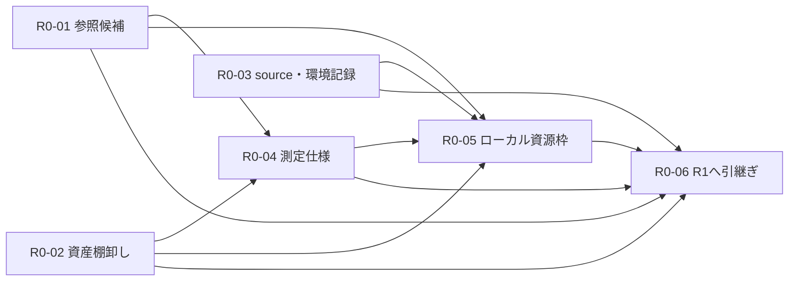

# R0 実行計画・作業票

起票日: **2026-09-21**。更新: **2026-09-25**。対象: **R0の対象・測定・資源の具体化**。各票の現在の状態・担当・証拠は[作業状態](../status.jp.md)を参照する。

[プロダクトロードマップ](../product-roadmap.jp.md)のR0と、[全体実行計画](solver-implementation-plan.jp.md)のT0-01〜T0-04を、着手可能な6件の作業票へ分解する。
HUの選定・比較方針は[初回検証計画](../validation.jp.md)を正とし、本書では実施順、手順、成果物、完了条件を定める。
本書はリポジトリ内の作業票。起票は実行・品質認定の完了を意味しない。

## 1. R0の目的と境界

R0の到達点は、**別の実施者がR1の参照取得・検証実装・基準測定を、対象や値の意味を推測せず開始できる状態**である。
利用者の大枠の回答は取得済み。通常の技術判断は作業内で記録して進める。

| R0で行うこと | R1以降へ引き渡すこと |
|---|---|
| 日常8件・拡張24件を初案に、具体的な参照候補と多様性を登録する | 各候補の全range・継続木・参照EV/頻度の取得と固定fixture化（T1-01） |
| 現行規範・code・test・既存参照の対応と不足を棚卸しする | solver・比較runner・不足testの実装/修正（T1/T2） |
| source・binary・環境を特定する記録形式と取得手順を決める | 実行ごとの実値の記録、保存/再開後も含む検証（T1-05） |
| Exploitability、参照比較、時間・メモリの測定仕様と暫定基準を作る | 基準測定から比較用閾値を固定する（T1-06） |
| ローカルの初回実行枠と、重い計算へ拡大する判断手順を定める | 全suite実行、教師生成、学習、必要時のクラウド利用 |

候補を特定するための既存GTO Wizard解の閲覧はR0に含む。全数値の取得、新規solve、credits消費はR0の完了条件に含めない。
R0で小さい動作確認が必要になった場合は、その目的と上限を記録する。24ケースのsolver計測はT1-05で行う。

以下の回答は変更せず使う。

- 初回はNLHE HU Postflopの厳密CFR。必要なベット・ハンド抽象化を許容する。
- 外部比較はGTO Wizardの既存解。日常5〜10件、拡張20〜30件。8/24件はこの範囲内の配分案。
- Rake・stack・Preflop Actionを分散し、street・position・boardも偏らせない。
- HU厳密計算の主指標はExploitability。高速近似等の評価方式は後続の研究調査で決める。
- 高速近似の初回出力は1ノードの各action EV。「数分」は努力目標。
- 通常規模のローカル計算は実行可。有料資源の支出枠は必要時に見積もって判断する。

## 2. 作業票一覧と依存関係

担当は各票を引き受けた実施者。利用者の判断が必要な残件は、R0-06の未決台帳へ判断時期とともに記録する。
状態・担当は[Linear](../status.jp.md)で管理する。受入に必要なのはR0-01〜R0-05、R0-06は完了判定である。

| 票ID | 件名 | 親作業 / 要件 | 必須の先行票 | 主成果物 |
|---|---|---|---|---|
| R0-01 | HU参照候補と日常・拡張セットを選定する | T0-01 / F0-01, F0-03 | なし | 候補台帳、多様性表 |
| R0-02 | 現行実装・検証資産・契約の差分を棚卸しする | T0-02 / F0-01, F0-02 | なし | 資産対応表、差分一覧 |
| R0-03 | source・binary・マシンの記録方式を整える | T0-02 / F0-02 | なし | manifest案、環境記録と取得手順 |
| R0-04 | HUの測定仕様と暫定判定を固定する | T0-03 / F0-02 | R0-01, R0-02 | 測定仕様、結果形式、許容差の扱い |
| R0-05 | 初回ローカル実行の資源枠を決める | T0-04 / F0-03 | R0-01, R0-02, R0-03, R0-04 | 初回実行票、拡大・停止の判断手順 |
| R0-06 | R0完了を確認し、R1へ引き渡す | T0-01〜T0-04 / F0-01〜F0-03 | R0-01, R0-02, R0-03, R0-04, R0-05 | 完了記録、未決台帳、R1への引継ぎ |



R0-01/R0-02/R0-03は独立して着手可能。R0-04は01/02の結果を受け、R0-05、R0-06の順で閉じる。
依存のない作業が同じファイルを変更するときは変更範囲を揃える。日付や所要時間の約束は、参照アクセスと作業量を確認してから設定する。

## 3. R0-01: HU参照候補と日常・拡張セットを選定する

**目的:** 多様性を持つ具体的な参照先を決め、R1が取得する対象を明確にする。

入力は初回検証計画のV1〜V8と既存GTO Wizardライブラリー。既存の24枠を起点とし、新しい配分案を一から作り直さない。

### 実施手順

1. V1〜V8に各3候補を割り当て、日常用フラグを各枠の代表1件に付ける。各caseに`HU-R0-001`等の安定したIDを付ける。
2. 既存solutionを画面で確認し、URL、solution名、元の卓人数、HUの2席、Preflop Action、開始street/board、rake、stackを台帳へ記録する。
3. range・EV・頻度・後続menuを取得できそうかを確認し、取得可能/要確認/取得不可を項目ごとに分ける。R0では全数値の転記を完了条件にしない。
4. 近い局面の重複を点検し、rakeなし/複数rake設定、浅い/標準/深いstack、SRP/3bet/4bet/その他、Flop/Turn/Riverを配置する。
5. 条件を再現できる見込みの候補を日常用へ優先する。欠ける枠は代替候補か不足理由を記録する。多様性と再現性が両立しない場合は両方の状態を残す。

**成果物案:** `docs/plans/hu-postflop-r0/cases.csv`と、同ディレクトリの`coverage.md`。これらは本票の実施時に作成する。

候補台帳の列は少なくとも以下を持つ。

```text
case_id, suite, diversity_slot, candidate_status, source_url, checked_at,
solution_label, table_players, seats, preflop_actions, street, board,
stack_bb, effective_stack, pot, rake_description,
range_access, tree_access, value_access, comparison_scope, missing_fields, next_action
```

`suite`は`daily+extended`か`extended`。不明値は空欄とし、理由を`missing_fields`へ残す。URLや確認日時を推測で埋めない。
`candidate_status`は`planned / catalog_checked / unavailable`、`comparison_scope`は`pending / same_game_candidate / diagnostic_only`とする。
`same_game_candidate`は完全再現の認定ではなく、R1で確認する候補区分である。

### 完了条件

- [ ] 拡張20〜30件・日常5〜10件の具体的候補を登録し、日常セットが拡張セットに含まれる。
- [ ] 採用候補は参照先と基本条件を確認済み。未確認の枠を確認済み件数に算入していない。
- [ ] 多様性表にRake・stack・Preflop Action・streetの分布と不足理由がある。
- [ ] 各候補にR1で取得する項目と、同条件比較の障害を記録している。

**取得できない場合:** 認証・アクセス不足は該当票の未完了理由に残す。R0-02/R0-03とR0-04の一般部分は進められる。
caseが足りない場合は許容された5〜10/20〜30件の中で調整する。必要数を満たせなければ、R0-06で不足を明示し、R0全体の完了と取り違えない。

## 4. R0-02: 現行実装・検証資産・契約の差分を棚卸しする

**目的:** 過去の成功や古い制限を現在の仕様と取り違えず、再利用するものとR1/R2の残作業を確定する。

### 実施手順

1. [HU規範](../solver-config-v1.jp.md)、[CLI](../cli-reference.jp.md)、[開発手順](../development.md)、[アーキテクチャ](../architecture.md)から、入力・実行・保存・照会・BR評価の対応を抽出する。
2. [HU oracle比較](../../crates/holdem/tests/oracle_diff.rs)、[HU本体test](../../crates/holdem/tests/postflop.rs)、[公開契約test](../../crates/cli/tests/postflop_contract.rs)をケース種別へ対応付ける。testの存在と今回の実行成功は別欄にする。
3. `crates/engine`のCFR/BR、`crates/cli`の入力・economics・保存経路を確認し、結果のExploitability/EVがどの戦略・単位・基準から計算されるかを特定する。
4. [既存GTO Wizard手順](../../experiments/hu-postflop-reference/procedure-2026-07.md)と保存済み参照を棚卸しする。旧CLI、street単位の木に関する制限、Preflop対応状況等は現行規範へ照合し、古い記述をそのまま採用しない。
5. 候補条件に必要な機能を`既存で対応 / 追加確認 / 不足 / 対象外`に分ける。不足には引継ぎ先のT1/T2作業を付ける。

**成果物案:** `docs/plans/hu-postflop-r0/asset-map.md`。
各行に対象能力、規範、code、test/既存証拠、現在確認した内容、未確認、次作業を記録する。

### 完了条件

- [ ] 入力→tree→CFR/BR→保存→EV照会の対応と、既存assetの再利用範囲が分かる。
- [ ] `cfr-ref`の凍結と独立性を維持する検証経路が記録されている。
- [ ] 過去の結果にsource/条件の違いを付記し、現在の合格証拠へ流用していない。
- [ ] 現行HUで未対応の`evaluate`等を、実行可能な手順に書いていない。必要なら内部BRと保存済みsummaryを使う設計、またはT2-03の残作業として扱う。
- [ ] 古い手順の差分に現在の根拠と扱いを記録し、規範と不一致の実装変更をこの棚卸しへ紛れ込ませていない。

## 5. R0-03: source・binary・マシンの記録方式を整える

**目的:** 未コミット変更を含む今回の計算条件を特定し、他のrunと正しく比較できる状態を作る。

### 実施手順

1. 現在のHEAD、作業ツリーの変更一覧、使用するCargo設定とtoolchainを確認する。既存変更のrevert・整理・commitをこの作業に含めない。
2. 測定sourceの記録形式を定める。HEADだけでなく、対象の変更patchと未追跡sourceを再構成できる保存先・hashを持つ。hashだけで再現可能としない。
3. CPU型番・物理/論理core、RAM総量/空き、OS、空きdisk、必要時のGPU/VRAM、電源・実行環境を記録する手順を作る。取得不可は理由と代替手段を残す。
4. binaryが既にある場合はpath・hash・build条件を確認する。出所不明なら測定用に再buildする扱いを決める。binaryが未作成なら、R1のbuild直後に実値を記録する欄を用意する。
5. sourceの記録とbuildの前後で変更がないことを確認する手順を定める。変更された場合は別のsource IDとし、測定結果を混在させない。

**成果物案:** `docs/plans/hu-postflop-r0/provenance.md`と`manifest-template.json`。
確認した環境等の実値は`experiments/hu-postflop-r0/readiness/`、大きいsource記録は再構成可能な保存先に置き、その対応を残す。

manifest案には`source_revision / dirty_patch / source_files / source_hash / binary_hash / build_command / rustc / cargo / cargo_config / host / config_hash / case_id / seed / run_status / evidence_paths`を持たせる。
これは研究記録の案であり、既存のrun manifestのschema変更ではない。既存情報と対応付け、欠ける項目だけ補助記録で保持する。

### 完了条件

- [ ] 1つのcaseに対し、実行前・build後・実行後のどこで各項目を埋めるかが明確。
- [ ] 現在のsource候補とマシン情報を取得した範囲・未取得範囲が分かる。
- [ ] runtimeの未作成binary/未実行runを、架空のhashや成功状態で埋めていない。
- [ ] RAM上限を決めるのに必要な情報をR0-05へ渡せる。不足情報があれば、solve開始前に取得する手段と時点を定める。
- [ ] `target/`を研究成果の保存先にせず、source記録を削除可能なcacheと混同していない。

## 6. R0-04: HUの測定仕様と暫定判定を固定する

**目的:** R1で同じ入力から同じ項目を測り、条件不足・計算失敗・品質不足を区別できるようにする。

### 実施手順

1. R0-01の候補を、同一ゲームで比較できる見込みのものと、条件差が残る参考比較へ分ける。
2. [初回検証計画](../validation.jp.md)の§4の指標を、現行の値の出力へ対応付ける。BRの対象は平均戦略、値の分母は開始pot、抽象化の範囲はcaseごとに明記する。
3. 零和の`(g_0 + g_1)/2`、一般和のseat別`g_i`とNashConvを区別する。保存前/後の戦略と、外部参照の値の基準を記録する。
4. 外部比較のEV差、range重み付き頻度差、大きいhand/action別差を定義する。値の丸め、未取得action、zero reach、rangeの重みの扱いを明記する。
5. 入力準備・初期化・CFR・BR・返却・保存の区間とprocessのpeak RSSを定義する。arena量をprocess全体のRAMと同一視しない。
6. 結果レコードと判定例を作り、未計測を0や成功で表さないことを確認する。1ノードEVの待ち時間と厳密CFRの所要時間を別にする。

**成果物案:** `docs/plans/hu-postflop-r0/measurement-protocol.md`と`result-template.json`。

### R0で固定するものと校正するもの

| 項目 | R0での扱い | 最終化する作業 |
|---|---|---|
| HU Exploitabilityの式・単位・対象戦略 | 固定する | R0-04 |
| 基準解0.1% pot、教師0.02% pot | 初稿の暫定候補として記録。採否理由を残し、runtime既定値は変えない | T1-05の測定後、T1-06で比較用に固定 |
| 外部EV差の許容差 | 比較単位、表示精度、数値誤差の扱いを定義。参照精度未取得なら未校正と記録 | T1-01/T1-06 |
| 頻度差 | 初期は診断指標。混合比の差だけで自動不合格にしない | T1-06で必要な診断基準を記録 |
| 日常suite所要時間・資源 | 計測区間と初回試行枠を決める。性能保証は置かない | T1-05で実測して運用枠を更新 |
| 高速近似・Multiway等 | 指標は未固定。調査候補と判断担当作業を記録 | T3-00および各段階の方式設計 |

参照EV差の許容差を、自作解のExploitabilityから自動算出しない。開始potで同じ正規化をしても、同じ誤差を表しているわけではない。
許容差が未校正のケースは観測値を報告し、合格にはしない。候補比較を始める前にT1-06の基準版を固定する。

結果は少なくとも`case_id / source_id / config_hash / comparison_scope / strategy_kind / g_i / metric_definition / ev_diff / frequency_diff / timing / peak_rss / reference_precision / threshold_version / run_status / quality_status / missing_fields`を持つ。
`run_status`の完走・時間切れ・資源超過と、`quality_status`の未判定・合格・不合格を分離する。

### 完了条件

- [ ] 指標・単位・分母・計測区間・評価対象の戦略が一意に分かる。
- [ ] Rake入り一般和、参照条件差、丸め、未取得、zero reachをどう報告するか記載済み。
- [ ] 暫定値・校正待ち・後段で決定の区別と担当作業がある。
- [ ] 正常、時間切れ、参照条件不足の記入例を作り、いずれも実測例ではないと表示している。
- [ ] 「数分」を厳密CFRの合否条件や初回近似の固定SLOにしていない。

## 7. R0-05: 初回ローカル実行の資源枠を決める

**目的:** 許可済みの通常ローカル計算からR1を始め、実測から重いケースへ拡大できるようにする。

### 実施手順

1. R0-01の候補から小さいRiverを初回、Turnを次、その後Flopへ進む実行順を作る。初回候補が変更されたら理由を記録する。
2. R0-03のマシン情報とR0-02の既存機能から、threads・同時実行数・processの時間/RAM監視・保存先を具体化する。
3. 小さい試行の上限と停止手段を記録する。HUの`[run] threads`/`[run] max_time`等は現行規範に従い、Multiway専用のCLI overrideを流用しない。
4. runtimeの停止時間が初期化・BR・保存のどこまで覆うかを確認する。覆わない工程は別に観測し、上限だけ記載して制御済みとしない。
5. 1件当たりの時間とpeak RSSから日常/拡張suiteを見積もる計算表を作る。ローカルで足りない場合だけ既存のクラウド概算を更新する手順を付ける。

初回pilotの運用案は、**同時実行1件、threadsは論理core数と8の小さい方、1件の全工程10分を観測上限**とする。
RAMの初期目安は`min(物理RAMの50%, 実行直前の空きRAMの75%)`。これは品質基準や製品既定値ではなく、最初の少量計測のための案。
実機・木の見積もり・停止手段を確認して値を調整し、採用した数値を実行票に残す。上限が不適切ならケースを縮めるか枠を再設定し、未収束を合格扱いしない。
教師の大量生成等への拡大はこの初回枠に含めず、実測を踏まえて別の実行規模を定める。

**成果物案:** `docs/plans/hu-postflop-r0/local-run-plan.md`。
初回case、後続順、config作成担当、source/binary記録時点、threads、時間/RAM上限、停止方法、出力先、完走後の確認、次に拡大する条件を1枚にまとめる。

### 完了条件

- [ ] 最初に実行する候補と、開始までにR1で取得・実装する項目が特定されている。
- [ ] 監視と停止の実現方法が分かり、未実装なら先行作業として明示されている。
- [ ] 通常ローカル実行は再承認待ちにしていない。有料枠が未定でもローカル着手可能。
- [ ] 資源不足・時間超過時の扱いと、計算量を拡大する判断材料が決まっている。
- [ ] 過去のクラウド額を現在の必須支出や実測費用として扱っていない。

## 8. R0-06: R0完了を確認し、R1へ引き渡す

**目的:** 実行可能な次手と未決事項を分け、R0の完了範囲を証拠付きで閉じる。

### 実施手順

1. R0-01〜R0-05の成果物とチェック項目を照合する。未作成の成果物はファイル名が決まっただけで完了としない。
2. R0-01のcase件数・日常の包含・多様性、各成果物のID/参照/単位、依存関係を検査する。
3. 未決事項へ担当作業・必要時期・前進可能な作業を付ける。GUI、profile、後続評価方式、クラウド費用を一括でR1の待ち条件にしない。
4. T1-01へ候補と取得項目、T1-02へ既存境界の監査結果、T1-05へ測定・実行仕様、T1-06へ校正項目を引き渡す。
5. Linearの依存・状態・次作業を更新し、Git側の完了証拠を作業IDで対応付ける。ロードマップ・計画・検証方法は受入条件や方針が変わった場合だけ更新する。

**成果物案:** 計画・未決台帳は`docs/plans/hu-postflop-r0/handoff.md`。
完了確認の証拠は`experiments/hu-postflop-r0/readiness/report-<date>.jp.md`。作成前はその名前を参照済みのリンクとして扱わない。

### R0全体の完了条件

- [ ] R0-01〜R0-05が完了し、各成果物の版と場所を参照できる。
- [ ] 参照候補の基本条件を確認済みで、完全な数値取得とfixture認定がT1-01に残ることを明示している。
- [ ] HU測定仕様・暫定基準・R1での校正手順がある。
- [ ] 未コミットsourceと実行環境を特定する手順、初回ローカル実行枠、必要なR1の準備作業が揃う。
- [ ] 未決事項が所有作業に割り当てられ、R1着手に必要な未解決の前提がない。
- [ ] R0完了と、solver品質・24件の比較成功・数分達成・ML評価方式の確定を混同していない。

R0-06の起票やチェックリスト作成だけでは完了しない。参照アクセス等が不足する場合は、完了した票と未完了票を分け、R1へ先行可能な範囲を明示する。

## 9. 最初の着手と更新方法

最初は**R0-01の候補台帳作成と既存ライブラリーの確認**に着手する。参照アクセス待ちの時間にはR0-02/R0-03を進められる。
R0-04の測定仕様を揃えた後、R0-05で初回実行枠を閉じ、R0-06でR1へ渡す。

作業の状態・担当・残件・次作業は[Linear](../status.jp.md)へ、成果物・source・確認結果はGit側の証拠へ記録する。
既存方針の確定と作業票の完了を区別し、本文のチェックリストは受入条件として使う。チェック済み状態はLinearと検証証拠で確認する。
公開契約やcodeを変更する必要が生じたら該当T1/T2作業へ結び付け、[AGENTS.md](../../AGENTS.md)の同期と検証に従う。
