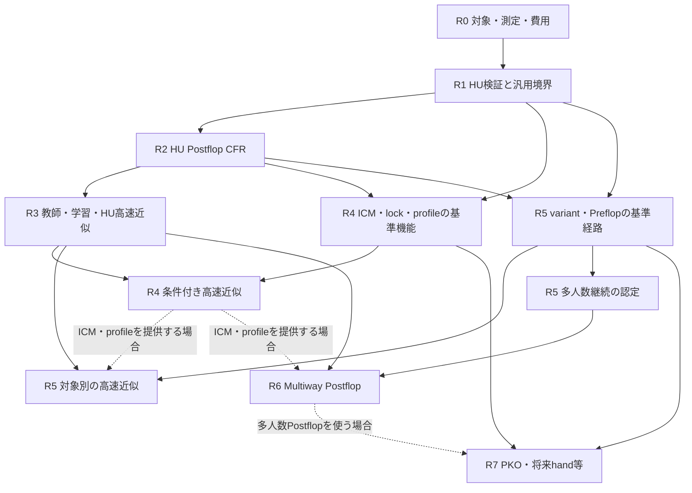

# ソルバー実行計画: マイルストーン・機能要件・作業依存関係

更新: **2026-09-25**。本書は要件・作業依存・完了条件を定義する。作業状態は[Linear](../status.jp.md)、検証証拠はリポジトリ内のtest・実験報告で管理する。

本書は[プロダクトロードマップ](../product-roadmap.jp.md)を、実装・検証に着手できる単位へ分解した実行計画である。
優先順位と利用者の決定はロードマップ、既存の設定・CLI・成果物の契約は各規範仕様を正本とする。
本書のタスク名・成果物案は、新しい設定項目やコマンドを実装済みとする宣言ではない。
方針を変えるときはロードマップを先に更新し、影響する本書の要件・依存・完了条件を同じ変更で直す。

参照: [現状・研究・サービス調査](../research/solver-roadmap-survey-2026-09-20.jp.md)、[費用概算](../research/solver-cloud-cost-estimate-2026-09-20.jp.md)、
[アーキテクチャ](../architecture.md)、[開発手順](../development.md)、[アプリ設計](../app-architecture.md)。
HU初回ケースの選び方と比較方法は[HU Postflop検証計画](../validation.jp.md)を参照。

## 1. 計画の読み方

- `R0`〜`R7`: ロードマップと同じマイルストーン。番号は優先順の目安であり、前の全機能が次の全作業の必須条件になるわけではない。
- `F0-01`等: その段階で実現・確定すべき機能または設計要件。各表の確認方法で受け入れる。
- `T0-01`等: 成果物を持つ作業。既存実装を検査する作業と新規実装を区別して記載する。
- `Q-01`等: 全段階に適用する品質・運用要件。
- 依存欄の通常の列挙は**すべて必須**。「条件付き」は記載した機能を提供する場合だけ必須。
- 「設計着手」と「実装を製品・教師として使うこと」を分ける。後段の設計は先行できても、未認定の解を正解labelとして大量生成しない。

各タスクの着手・完了状態は[Linear](../status.jp.md)で確認する。既存資産の存在だけで完了認定しない。
過去のtest成功、入力欄の存在、文書作成だけでマイルストーンを完了にしない。
各実装タスクの完了には、対応要件の証拠とQ-01〜Q-08が必要になる。

### 確定している前提

初回はNLHEのHU PostflopのCFR。必要なベット・ハンド抽象化を許容し、抽象ゲーム内の残差と元ゲームへの影響を分ける。
その解を教師に高速近似へ進む。クラウドと長時間の事前学習を利用でき、支出上限は見積もり後に利用者が決める。
極端に重くない計算はローカルで実行可。GTO Wizard比較は日常5〜10件、拡張20〜30件とし、Rake・stack・Preflop Action等を分散する。
HU厳密計算はExploitabilityを基本に評価する。高速近似の初回出力は1ノードの各action EVで、「数分」は努力目標。
後続の評価方式は研究を広く調査して各段階で決める。具体的な参照ケースとHUの閾値はT0-01/T0-03/T1-06で固定する。
ルールの一般化は初期から検証する。相手の誤認を主対象とするprofile、Nodelock、通常MTTと通常サテライトの共通ICMを扱う。
Multiway PostflopとPKOは低優先。Multiway Preflopに必要な内部の継続評価は別に計画する。

### 既存資産と残作業

| 領域 | 既存資産・確認先 | 本計画で必要な仕事 |
|---|---|---|
| HU CFR / BR | [engine](../../crates/engine/src/solver.rs)、[holdem](../../crates/holdem/src/postflop.rs)、[独立oracle比較](../../crates/holdem/tests/oracle_diff.rs) | 受入範囲の固定、数値・抽象化・保存後の品質、教師としての認定 |
| ゲームの共通化 | [game](../../crates/game/src/lib.rs)、[私的状態の次元遷移](../../crates/engine/tests/dimension_changing_transitions.rs) | Stud/Draw等の観測・履歴・phase・精算を表す共通境界と縮小ゲームでの照合 |
| HU ICM | [HU規範のutility](../solver-config-v1.jp.md)、[TournamentIcm](../../crates/cli/src/economics.rs)、[契約テスト](../../crates/cli/tests/postflop_contract.rs) | 卓外fieldを含む公開入力・runtime接続は存在する。接続を一から作るのではなく、賞金EV・平坦payout・大規模性能を再認定する |
| 大規模ICM | [multiway ICM](../../crates/multiway/src/icm.rs) | exact/MC切替、prepared経路の卓外stack圧縮、推定誤差と戦略誤差を分離して検証 |
| Multiway | [現行契約と実装対応](../multiway-preflop-v1.md) | 評価器の強度、教師の品質、`.mwsol`の規範とwriterの不一致を解消 |
| HU Preflop | [継続モデル](../../crates/preflop/src/model.rs)、[bucketed継続](../../crates/preflop/src/bucketed.rs) | 現行近似を全ゲーム厳密解と扱わず、基準計算と学習済み継続を別経路として検証 |
| 保存・ジョブ・照会 | [formats](../../crates/formats/src/lib.rs)、[CLI](../cli-reference.jp.md)、[daemon設計](../app-architecture.md) | 既存のcancel/resume/export/compare等を再利用。model・抽象化・条件付き戦略の情報を追加する際は契約を同期 |
| ML / lock / profile | [現状との差分](../research/solver-roadmap-survey-2026-09-20.jp.md) | 教師・学習・推論・再計算、戦略制約、主観評価と客観EVの分離を新設 |

## 2. マイルストーン一覧と依存図

| 段階 | 利用可能になるもの・成果 | 主な完了判定 | 先行成果 |
|---|---|---|---|
| R0 | 初回の対象、測定方法、判断すべき仕様、費用枠 | 受入計画と未決事項に担当作業・判断時期がある | 利用者の回答、現行コード・規範 |
| R1 | HUの検証基盤と汎用ゲーム境界 | HUの独立照合、Stud/Draw等の設計検査、基準測定 | R0の対象・snapshot・測定定義。支出判断は有料実行時のみ |
| R2 | HU PostflopのCFRを設定・実行・保存・照会できる | 対象ケースで残差・保存後の値・再現性が基準内 | R1。GUI全機能、Multiway、HU Preflopは待たない |
| R3 | 認定したHU教師と、限定HUの1ノードaction EV近似 | 研究調査後に選ぶ指標で品質を認定。待ち時間・費用と数分目標の達否を報告 | R2認定。評価研究とschema設計はR2完了前から可能 |
| R4 | ICM・Nodelock・相手profileの基準計算と高速近似 | 各機能と選定した組合せの意味・品質を確認 | 基準機能はR1/R2、高速統合はR3も必要 |
| R5 | 共通基盤でvariantとPreflopの対応を増やせる | 追加するgameと計算modeごとの認定 | R1/R2。高速modeにはR3、ICM/profile対応にはR4の該当機能 |
| R6 | 任意のMultiway Postflop開始を扱う（低優先） | 採用人数・条件で品質・速度・coverageを認定 | R5の多人数継続の検証。全variant完成は不要 |
| R7 | PKO等・FGS・追加の特殊ルール | 選定機能ごとのutility・品質・費用の認定 | R4/R5の必要部分。R6は多人数Postflopを使う場合だけ |

実線は主な前提、破線は提供範囲に応じた前提。作業単位の正確な依存は以降の表に記す。
R4の機能設計・通常ICM検証は早期から進められる。R3の通常HU教師をR4全体の完成待ちにしない。
R5はgameごとの反復工程であり、全ポーカーバリアントを一括して完了させる判定は置かない。

## 3. 全マイルストーン共通の要件

| ID | 実現しなければならないこと | 受入証拠 |
|---|---|---|
| Q-01 | 解いたゲーム・抽象化・utility・許す逸脱を明示し、CFR残差と各近似の影響を分ける | 独立oracle/BR、抽象化感度、保存後の評価。一般和・多人数へ零和の収束保証を流用しない |
| Q-02 | 入力確定から利用可能な結果までの時間と、process全体のRAM/VRAM・費用を測る | cold/warm、P50/P95、timeout/OOD率。1ノードEV返却は準備・通常評価・返却を含め、永続保存も別区間で測る。数分は現時点の合否条件にしない |
| Q-03 | 結果・教師・modelを再現でき、checkpointと閲覧用成果物の役割を分ける | config、sourceと未コミット差分、binary、game/tree/abstraction、utility/profile、seed、model/data ID、環境と状態 |
| Q-04 | 公開契約の変更を同じ変更セットで同期し、未対応を明示する | 規範、実装guide、parser/runtime、CLI/user guide、test、例/help、metadata。黙った人数制限・近似切替・未計算値の補完がない |
| Q-05 | プレイヤーが知り得る情報だけで戦略を作り、ルール・精算を正しく共通化する | 観測の同値性、私的履歴、chance/card removal、legal action、showdown、side/split potの独立ケース |
| Q-06 | 計算結果を解釈できる形で照会する | seat/hand/action、EV単位と基準、主観値と客観EV、計算範囲、近似・未判定・timeout。戦略を提供するmodeでは頻度も表示し、1ノードEVの最小出力と区別 |
| Q-07 | 独立検証とデータ・コードの利用条件を保つ | `cfr-ref`凍結・本体との実装独立、[LICENSE-POLICY](../../LICENSE-POLICY.md)に沿った出所。教師は自作の認定解から開始 |
| Q-08 | 変更に必要な検証を通し、採否を再現可能な証拠で閉じる | [必須のfmt/clippy/test](../development.md)、対象に必要なignored acceptance、入力・結果・採否理由。過去の成功を新snapshotの成功にしない |

品質・時間の候補値は[ロードマップ§6](../product-roadmap.jp.md#6-数分と妥当な精度の受入設計)に集約する。
本書は別の数値基準を作らない。HU厳密計算の定義と暫定閾値はT0-03、比較用基準はT1-06で固定する。
高速近似以降の評価方法はT3-00等の研究調査から選び、対象方式の比較前に固定する。時間の参考値を合意済みSLOにしない。
一般和・Multiwayの評価器で検出したgainは、未探索の逸脱を含むexploitabilityの上界とは扱わない。

## 4. R0: 対象・精度・予算の具体化

**入口:** 利用者の大枠の回答は取得済み。現行規範・作業ツリー・調査・概算を起点にする。
T0-01〜T0-04の具体的な手順・成果物・チェック項目は[R0実行計画・作業票](r0-execution-plan.jp.md)の6票に分解した。各票の状態はLinearで管理する。

| 要件ID | 実現・確定する内容 | 確認方法 |
|---|---|---|
| F0-01 | 初回HU比較セットの構成と、game/range/stack/pot/menu/utility、出力を列挙する | GTO Wizardの日常5〜10件・拡張20〜30件の対象表。初回近似は1ノードaction EV。参照の確定/候補/不足を区別 |
| F0-02 | HUのExploitability、外部解との差、時間・メモリの測り方と失敗時の扱いを決める | 式・単位・計測区間・ケースIDと暫定閾値。rake時の一般和、参照条件差、未判定を区別 |
| F0-03 | ローカル実行方針、概算、段階別費用判断、GUI/profile/後続指標の決定時期を記録する | 通常ローカル実行は許可済み。重い計算と有料利用の判断を分け、後続評価研究の作業を特定 |

| 作業ID | 行う作業と成果物 | 要件 | 必須の先行作業 |
|---|---|---|---|
| T0-01 | 日常/拡張セットの多様性表と参照選定台帳を作る。D2の1ノードEVを反映し、具体的な参照条件・D6/D10・後続評価方式の決定時期を記録 | F0-01, F0-03 | なし |
| T0-02 | 現行規範・code・test・既知の不一致を一覧化し、測定用source/binaryを特定するmanifestの形式を決める | F0-01, F0-02 | なし |
| T0-03 | HUのExploitabilityとrake時のBR集計、参照EV/頻度の比較、計測区間、oracle、分割、暫定許容差、失敗/未判定を定義する | F0-02 | T0-01 |
| T0-04 | 通常ローカル実行の資源方針を記録し、必要な有料部分のみ計測・教師・学習・通常利用に分けて見積もる。支出枠は有料実行前に判断 | F0-03 | T0-01, T0-02, T0-03 |

**終了条件:** 対象表・測定計画・未決台帳があり、直近の実行に必要な資源枠が分かる。
予算判断は実際に支出する工程の前提であり、後段全体の予算未定をR1のローカル検査・設計の停止条件にしない。

## 5. R1: HU検証と汎用ゲーム境界

**入口:** T0-01〜T0-03。既存CFR・BR・private transition・保存機能を再利用する。

| 要件ID | 実現する機能 | 確認方法 |
|---|---|---|
| F1-01 | 小さいHUの独立照合と、GTO Wizard比較の固定セットを再実行できる | 独立oracleに加え日常5〜10件・拡張20〜30件。Rake/stack/Preflop Action、条件差・丸め・EV/頻度・Exploitabilityの記録 |
| F1-02 | 配札・観測・私的履歴・交換・phase・betting・精算を共通境界として表現できる | NLHEに加えStud/Draw等の縮小ゲームが表現可能。NL/PL/FL、Hi-Lo等の境界を記録 |
| F1-03 | ベット・ハンド抽象化の写像と戦略を元の表現へ戻す規則を定義できる | 候補size追加、bucket細分化、chance重み、perfect recallの保持/喪失を確認 |
| F1-04 | CFR中・保存後・再開後の値と資源を同じ条件で測れる | sourceを固定したbenchmarkとroundtrip。arenaサイズとpeak RSSを分離 |
| F1-05 | どの範囲の証拠でHUを認定するか固定できる | 基準結果、採用した閾値、未対応・未判定ケースの一覧 |

| 作業ID | 行う作業と成果物 | 要件 | 必須の先行作業 |
|---|---|---|---|
| T1-01 | GTO Wizard参照の条件・値を取得し、日常/拡張の固定fixtureと比較手順を作る。独立oracleの不足ケースも補う。凍結oracle本体は変更しない | F1-01 | T0-01, T0-02, T0-03 |
| T1-02 | 共通ゲーム境界を設計する。private/public deal、観測、phase、legal action、settlementをNLHEの型との対応付きで記述 | F1-02 | T0-01, T0-02 |
| T1-03 | 縮小Stud/Draw等を共通境界で表すprototypeと独立期待値を作る。手札の次元変化・私的履歴・split potの不足を検出 | F1-02 | T1-02 |
| T1-04 | 抽象化の識別子・写像・評価範囲を定義し、粗密の対照ケースと必要な補助実装を作る | F1-03 | T1-01, T1-02, T1-03 |
| T1-05 | 通常規模からローカルで初期化/CFR/BR/保存の時間・RSSと保存/再開後の値を測る。日常/拡張セットと小さいoracleを分ける | F1-04 | T1-01, T1-04, T0-03 |
| T1-06 | 基準結果から受入閾値・対象範囲を固定し、修正事項と費用を更新する。比較開始前の基準版を発行 | F1-05 | T1-03, T1-04, T1-05 |

**終了条件:** T1-06の認定記録がある。Stud/Drawの実用ソルバー完成ではなく、異なる情報構造を表せることを確認する。
T1-02〜T1-04で必要となる共通化はcold pathを優先し、HU専用kernelの性能を測って保つ。

## 6. R2: HU Postflopの厳密CFRを実用化

**入口:** R1のHU・共通境界の成果。通常のNLHEを初回の実用基準にする。

| 要件ID | 実現する機能 | 確認方法 |
|---|---|---|
| F2-01 | River/Turn/Flop開始の選定範囲を入力・検証・計算できる | range/board/stack/pot/menu/utilityがeffective configと木へ一貫して反映される |
| F2-02 | 定義した有限ゲームをCFRで解き、対応するBRと数値誤差で品質を示す | NN leafを使わず、抽象ゲーム内の残差と抽象化感度を確認 |
| F2-03 | 戦略とhand/action別の値を保存し、教師用の値の意味を確定できる | conditional EV/CFV、到達重み、基準pot、単位、zero reachの定義とroundtrip |
| F2-04 | 長い計算を監視・中断・再開し、資源不足・時間切れを明示できる | 既存CLI/daemon/checkpointを使う再現試験。途中結果を収束済みと表示しない |
| F2-05 | 解と品質を照会・比較できる | 少なくともCLI/daemonのquery/export/compareで確認。GUIの必須性はD10で決める |
| F2-06 | 受入済みの条件だけを教師生成に渡せる | 通常の利用基準と教師基準、対象範囲、sourceを結ぶ認定記録 |

| 作業ID | 行う作業と成果物 | 要件 | 必須の先行作業 |
|---|---|---|---|
| T2-01 | 対象表と現行HU入力・tree builderを照合し、必要な機能差分を実装する。非対称stack等は表現要件を決めてから変更 | F2-01 | T1-01, T1-02 |
| T2-02 | CFR更新・BR・数値設定を対象ケースで検査し、必要な修正を行う。残差、抽象化、storageの影響を個別に測る | F2-02 | T2-01, T1-04 |
| T2-03 | `.sol`と教師に使う戦略・値・metadataを監査し、足りない出力を追加する。保存済み戦略の再評価経路を整備 | F2-03 | T2-01, T0-03 |
| T2-04 | 既存job/cancel/resumeを対象HUで検証し、資源見積り・中断時の状態・クラウド実行手順の不足を補う | F2-04 | T2-01 |
| T2-05 | 既存CLI/daemonの設定→実行→照会→比較を通し、品質区分と未計算/失敗の表示を整える | F2-05 | T2-03, T2-04 |
| T2-06 | D10で選んだ場合、最小viewerを実装する。node/board移動、hand戦略・EV・品質を既存APIで表示 | F2-05 | T2-05。条件付き: D10で初回GUIを選ぶ |
| T2-07 | R2の受入を行い、基準計算として使える条件と教師に使える精度条件をそれぞれ登録する | F2-06 | T1-06, T2-02, T2-03, T2-04, T2-05。初回GUIを含める場合はT2-06 |

**終了条件:** T2-07の対象表・結果・再現手順が揃う。全合法bet、HU Preflop全ゲーム、全variant、GUI全機能は条件にしない。
現行の`evaluate`コマンドはMultiway専用である。T2-03の再評価を公開コマンドにするか内部検証にするかは契約設計で決める。

## 7. R3: HU教師生成・学習・局所探索

**入口:** 評価研究T3-00はR0の対象・出力方針から先行できる。データ設計はT2-03も必要。認定教師の生成はT2-07の完了後に行う。

| 要件ID | 実現する機能 | 確認方法 |
|---|---|---|
| F3-01 | range・局面・tree・utility・抽象化を含む教師問題とhand別labelを生成できる | labelの単位・正規化・到達重み・品質・出所を復元可能 |
| F3-02 | 学習/検証の漏洩を避け、品質不足の教師を除外できる | 同型board、range生成元、stack/menu/profile等を考慮した分割とmanifest |
| F3-03 | 条件付きvalueモデルを再現可能に学習・登録できる | baseline比較、seed、学習条件、checkpoint、data/model ID、実費 |
| F3-04 | batch推論とモデル適用範囲の判定を行える | 範囲外・不整合・OOMを検出し、未対応か明示した追加計算へ送る |
| F3-05 | 局所CFRと学習値を接続し、履歴と到達価値を整合させ、指定ノードの各action EVを返せる | 値の粒度・基準と到達条件を再現。方式が構成する継続戦略も検証し、1ノードの値から全木の品質を主張しない |
| F3-06 | 研究調査に基づく指標で品質を認定し、利用者が待つ全工程の速度・費用を明らかにする | 指標の採用理由、固定held-out、cold/warm、P95と数分目標の達否。全木返却と固定時間保証を初回要件にしない |

| 作業ID | 行う作業と成果物 | 要件 | 必須の先行作業 |
|---|---|---|---|
| T3-00 | 近似系の評価研究を広く調査する。value誤差、action選択損失、継続戦略/BR、較正・分布外評価等を比較し、採用方式の指標・限界・暫定基準を記録 | F3-06 | T0-01, T0-03 |
| T3-01 | 1ノードaction EVの粒度、教師schema、入力、CFV/EV label、抽象化写像、品質判定と生成manifestを設計 | F3-01 | T2-03, T3-00 |
| T3-02 | 認定HUの教師生成runnerを作る。条件sampling、batch、再開、失敗記録、重複排除、単価計測を含む | F3-01 | T3-01, T2-07 |
| T3-03 | labelの独立検査とtrain/validation/testの分割を実装し、最初の小データセットを認定する | F3-02 | T3-02 |
| T3-04 | River等の限定domainでvalueモデルを学習し、単純なcache/蒸留等と比較する。学習コード・重み・履歴を保存 | F3-03 | T3-03 |
| T3-05 | 推論adapter、batch、model registry、適用範囲チェックを実装し、実行環境で検証する | F3-04 | T3-01, T3-04 |
| T3-06 | 学習した継続価値を局所CFRへ接続する。公開履歴・belief・境界値の扱いと再計算手順を実装 | F3-05 | T3-05, T2-02 |
| T3-07 | T3-00で選んだ指標で返却action EVとNN・再計算の誤差を独立評価。時間・メモリ・費用を測り、戦略を構成する方式ではそのBR等も評価 | F3-06 | T3-00, T3-03, T3-06, T2-05 |
| T3-08 | 限定HU高速modeを受け入れる。達成domain、返却範囲、未判定/OODの動作、再学習条件を公開契約・成果物へ反映 | F3-03, F3-04, F3-05, F3-06 | T3-07 |

**終了条件:** T3-08の認定範囲で選定した品質基準を満たし、時間・資源・費用の実測を公開する。
数分目標の達否は別に記録する。目標未達だけで初回近似の提供を止めず、実際の待ち時間と改善課題を示す。低い学習lossだけで品質認定しない。
通常規模のローカル試行は許可済み。教師の大量化等で資源負荷が大きくなるときは規模を再見積もりし、有料実行にはT0-04の支出枠を用いる。

## 8. R4: ICM・Nodelock・相手profile

**入口:** 基準機能の設計・検証はR1/R2から着手できる。条件付きの高速modeだけがR3を必要とする。

| 要件ID | 実現する機能 | 確認方法 |
|---|---|---|
| F4-01 | 通常MTT・同額チケット型サテライトを共通ICMで扱う | 既存のHU接続を含め、小fieldの独立exact、15/16人境界、大field高予算MC、平坦payout、脱落・同着を照合 |
| F4-02 | ICMの数値近似・field圧縮・戦略計算の誤差と費用を分ける | HUとMultiwayで使う経路を個別に測定。賞金EV・action差分の誤差、prepare/cache時間を記録 |
| F4-03 | node/combo/actionの全固定・部分固定と、到達rangeで重み付けした総頻度lockを扱う | 確率和・残余確率・到達率0・複数制約・矛盾・保存後のtree変更を検証 |
| F4-04 | 固定相手への最大応答と、部分lock下の再最適化を区別する | 元ゲームの自由BRと制約付きBR、lock遵守、基準との比較 |
| F4-05 | 特定条件で価値を誤認する相手を設定し、実ルールでのEVを報告する | 認知モデルの具体例、条件・単位・加算/倍率・重複合成・horizon、情報制約を検証 |
| F4-06 | ICM・lock・profileを組み合わせても値と制約の意味が一貫する | subjective/客観EVの分離、lock優先規則、profile無効時の一致、凍結相手と再適応相手の区別 |
| F4-07 | 条件を変えた高速近似にも対応範囲と品質を示せる | 条件付き教師・model、範囲外判定、先読み外の仮定、独立held-outと時間を確認 |

| 作業ID | 行う作業と成果物 | 要件 | 必須の先行作業 |
|---|---|---|---|
| T4-01 | 既存ICMを独立系と比較するfixtureを追加し、exact/MC/field圧縮の違いを測る。通常MTTと平坦payoutを含める | F4-01, F4-02 | T1-01, T0-03 |
| T4-02 | 既存HU ICMの入力→utility→保存EVを再認定する。単位・基準offset・一般和評価・cache/準備時間の不足を修正 | F4-01, F4-02 | T4-01, T2-03, T2-07 |
| T4-03 | Nodelockの対象指定、固定/自由部分、総頻度の重み、矛盾、再計算mode、保存形式を仕様化する | F4-03, F4-04 | T1-02, T2-03 |
| T4-04 | lockと残余最適化、総頻度制約、対応する評価器を実装し、独立した小ゲームで制約と応答を検証 | F4-03, F4-04 | T4-03, T2-07 |
| T4-05 | 相手の誤認の具体例から、incentive/価値/beliefの方式を選ぶ。主観値・客観EV・horizon・lockとの合成を仕様化 | F4-05, F4-06 | T0-01, T1-02, T2-03, T4-03 |
| T4-06 | 選んだprofile方式と元utilityでの再評価を実装し、相手戦略の凍結/再適応、条件の情報制約を検証 | F4-05, F4-06 | T4-05, T4-04, T2-07 |
| T4-07 | ICM・lock・profileの基準計算を個別/組合せで受け入れ、教師として使える条件を登録する | F4-01, F4-02, F4-03, F4-04, F4-05, F4-06 | T4-02, T4-04, T4-06 |
| T4-08 | 条件付き教師を生成・学習し、model適用範囲、先読み外の評価、追加計算の扱いを高速経路へ統合する | F4-07 | T4-07, T3-08 |
| T4-09 | 設定→再計算→保存→比較を通してR4を認定する。対応組合せ、品質・時間、主観/客観EV、未対応を表示 | F4-06, F4-07 | T4-08, T2-05 |

**終了条件:** 対象として選んだ各機能・組合せをT4-09で認定する。T4-02、T4-04、T4-06の基準機能はそれぞれ先に提供できる。
T4-07を待つのは「全3機能を含む教師」であり、通常HU教師は待たない。PKOやFGSをR4の条件にしない。
ICMによる一般和計算に対しては、通常の零和HUと同じ収束保証・品質ラベルを付けない。

## 9. R5: 共通基盤でvariantとPreflopを広げる

**入口:** R1の汎用境界とR2の計算・保存。R5は追加するgame/modeごとに実施する。

| 要件ID | 実現する機能 | 確認方法 |
|---|---|---|
| F5-01 | 新variantを共通のルール定義と必要な専用処理の組合せで追加できる | 手札/phase/観測、NL/PL/FL、使用枚数、high/low、精算を独立照合 |
| F5-02 | gameと抽象化が変わっても同じ設定・保存・照会の仕組みを使える | hand/action ID、bucket写像、utility、品質、対応機能のmetadataが一貫 |
| F5-03 | 対象HU variantとHU PreflopにCFR基準経路を用意できる | 選んだ有限ゲームのCFR/BR、抽象化感度、MLなしの継続と近似継続の区別 |
| F5-04 | Multiway Preflopに必要な継続の教師と品質評価を用意できる | 小ゲームのBR、独立deviatorの校正、joint belief/card removal、side pot、保存coverage |
| F5-05 | 対象variant・HU/Multiway Preflopに高速近似を提供できる | 新domainの教師・model・OOD・返却戦略・時間・費用を個別に認定 |

| 作業ID | 行う作業と成果物 | 要件 | 必須の先行作業 |
|---|---|---|---|
| T5-01 | R1の検証結果から追加対象を選び、game/mode/人数/抽象化/utility/出力の範囲と費用を固定する | F5-01, F5-02, F5-03, F5-04, F5-05 | T1-03, T1-04 |
| T5-02 | 必要な共通ルール部品、役評価・精算、専用kernelを実装し、独立したルールfixtureで照合する | F5-01 | T5-01, T1-02 |
| T5-03 | 対象gameの設定・hand/action表現・抽象化・成果物・照会adapterを追加する。対応表と契約を同期 | F5-02 | T5-02, T2-05 |
| T5-04 | 対象HU variantのCFR/BRと元表現への戦略展開を認定する。一般和や記憶を失う抽象化の扱いを明示 | F5-03 | T5-02, T5-03, T2-07 |
| T5-05 | HU Preflopの基準ゲームを定義し、trunkとPostflop継続のCFR経路を実装・認定する。現行の近似モデルと品質区分を分ける | F5-03 | T5-04 |
| T5-06 | `.mwsol`のPreflop-only規範と全street writerの不一致を解消する。writer/reader/metadata/評価/拒否境界を一緒に検証 | F5-02, F5-04 | T0-02, T2-03 |
| T5-07 | Multiway継続の教師候補を独立評価する。deviatorの強度・seed・予算・深い枝を検査し、完全なstateと保存範囲を区別 | F5-04 | T5-06, T1-04, T1-02 |
| T5-08 | 認定したHU variantの教師・推論・再計算を追加し、高速modeを評価する。HU Preflopでは継続条件を含める | F5-05 | T5-03, T5-04, T3-08。HU Preflopを含める場合はT5-05 |
| T5-09 | 認定Multiway継続を用いてPreflop近似を実装する。人数別入力、joint belief、bunching、教師・modelを検証 | F5-05 | T5-07, T3-08 |
| T5-10 | 追加game/modeの公開契約・成果物・運用・品質を受け入れ、対応表の当該行だけを更新する | F5-01, F5-02, F5-03, F5-04, F5-05 | 対象別に以下の完了条件を適用 |

**T5-10の対象別終了条件:**

| 提供する範囲 | 必須作業 | 完了時に言えること |
|---|---|---|
| HU variantのCFR | T5-03, T5-04 | 選定game/抽象化で基準計算を認定 |
| HU PreflopのCFR | T5-03, T5-05 | 選定したPreflopからの有限ゲームの基準計算を認定 |
| HU variant / HU Preflopの高速近似 | T5-08 | 認定した学習domainで高速modeを提供 |
| Multiway Preflopの高速近似 | T5-06, T5-07, T5-09 | 内部継続を含む選定条件の近似を認定 |
| 上記へのICM・lock/profile追加 | 対象行の作業に加えT4-07。高速modeならT4-09も必要 | 当該game向けのadapterと再検証が完了した組合せだけを提供 |

他の行の完成は待たない。R5全体を一つの無期限gateにせず、選択した対象行の要件だけを閉じる。
Multiway Preflopの内部でPostflopを評価できることと、任意Postflop開始の製品機能は別である。
全バリアントで同じNNの重みが使えるとは仮定しない。共通の生成・学習・評価の仕組みを再利用する。

## 10. R6: Multiway Postflop（低優先）

**入口:** R5の多人数継続の認定と、R3の高速計算基盤。初回人数を3人とするのは後段で採否を決める案である。

| 要件ID | 実現する機能 | 確認方法 |
|---|---|---|
| F6-01 | 複数人が残る任意Postflop局面を入力・検証できる | 個別stack/range、既投入額、side pot、fold済み情報、行動順、chance/card removal |
| F6-02 | 人数に合う継続価値と局所探索で戦略を返せる | 各seatの価値、joint belief、深い枝のcoverage、人数変更時のモデル適用範囲 |
| F6-03 | 全seatの戦略・値・品質を保存・照会できる | Postflopの公開契約、保存後の再評価、未計算node、checkpointとの区別 |
| F6-04 | 採用したICM・lock/profileの組合せを多人数へ適用できる | 全seatでの制約・値の意味、客観EV、horizon、条件付き教師 |
| F6-05 | 採用人数・条件で実用精度と時間を認定できる | 校正済みdeviator、held-out CI、予算/seed感度、P95、RAM/VRAM、未判定率 |

| 作業ID | 行う作業と成果物 | 要件 | 必須の先行作業 |
|---|---|---|---|
| T6-01 | 対応人数・開始street・stack/side pot・range/belief入力・対応utilityを決め、fixtureと新規公開契約を設計する | F6-01 | T1-02, T5-07 |
| T6-02 | Multiway任意Postflop開始をruntimeへ実装し、精算・行動順・card removal・既存Preflopとの接続を検証 | F6-01 | T6-01 |
| T6-03 | 対象人数の教師・model・局所探索を接続し、初期Riverから選定範囲へ拡張する | F6-02 | T6-02, T5-07, T3-08 |
| T6-04 | Postflop成果物・CLI/daemon・選定viewerを実装し、全seatの戦略/EV/qualityを往復検証 | F6-03 | T6-02, T5-06, T2-05 |
| T6-05 | ICM・lock/profileを当該人数へ拡張し、制約と条件付き近似を認定する | F6-04 | T6-03, T4-09。条件付き: その組合せを提供する |
| T6-06 | 選定Multiway Postflop domainを受け入れ、品質・時間・費用と制限を公開する | F6-05 | T6-03, T6-04。ICM・lock/profileを含める場合はT6-05 |

**終了条件:** T6-06の選定範囲でF6-01〜F6-03/F6-05を満たす。F6-04は対応を宣言した組合せで満たす。
人数制限・許さない継続・未対応utilityを入力時に明示し、内部で黙って人数を減らさない。
小さい検出gainや強い対人性能だけではNash均衡の認定にしない。

## 11. R7: 特殊大会と追加の精密化

**入口:** 必要性が明確になった機能だけを選ぶ。PKOは低優先、FGS・特殊形式は別々に費用と価値を評価する。

| 要件ID | 実現する機能 | 確認方法 |
|---|---|---|
| F7-01 | 追加形式の勝敗・賞金・終了条件と効用を明示できる | 通常ICMとの差分、即時賞金と継続価値、後続gameの入力を定義 |
| F7-02 | PKO等のbounty精算と将来価値を扱える | 誰が誰をcoverするか、脱落・同着、即時受取と残るbountyの独立ケース |
| F7-03 | FGS等で次hand以降の状態遷移と価値を計算できる | blind/ante/位置/脱落/stack、深さと末端評価、計算費用の感度 |
| F7-04 | 選定した特殊形式で教師・推論・保存・品質を一貫して扱える | 当該形式のデータと独立検証。通常ICMやchipEVのラベルと混同しない |

| 作業ID | 行う作業と成果物 | 要件 | 必須の先行作業 |
|---|---|---|---|
| T7-01 | 追加形式を選び、ルール・utility・正確に計算する範囲・近似・受入方法・費用を仕様化 | F7-01 | T1-02, T4-07 |
| T7-02 | 選んだbounty形式の精算と継続価値を実装し、独立ケースで照合する | F7-02 | T7-01。条件付き: bounty形式を選ぶ |
| T7-03 | 将来handの遷移と探索・末端評価を実装し、深さと誤差/費用の関係を測る | F7-03 | T7-01, T5-05。条件付き: FGS等を選ぶ |
| T7-04 | 当該形式の教師・model・推論・metadataを追加し、通常utilityとの混用を防ぐ | F7-04 | T7-01, T3-08。対象がbountyならT7-02、FGSならT7-03。多人数Postflopを使う場合はT6-06 |
| T7-05 | 選定形式の基準計算/高速計算を別々に受け入れ、対応表・手順・品質と費用を公開 | F7-01, F7-04 | T7-01と対象別のT7-02またはT7-03。高速計算を提供する場合はT7-04 |

**終了条件:** T7-05で選定した形式・modeの要件を満たす。PKOとFGSを相互の必須依存にはしない。
通常サテライトの対応はR4であり、この段階を待たない。

## 12. 実装箇所と変更時に同期する成果物

以下は既存の入口と変更候補。新crateや新schema名の確定ではなく、T1-02等の設計で境界を決める。

| 作業領域 | 主な既存の入口 | 一緒に扱う成果物 |
|---|---|---|
| 汎用ルール・観測・精算 | `crates/game`、`cards`、`hand-index`、`engine/tree.rs`、`holdem`、`multiway` | game定義・情報集合・抽象化の設計、独立fixture、variant対応表 |
| CFR・BR・数値 | `crates/engine`、`holdem`、`preflop`、`multiway` | oracle差分、収束・精度・性能のvalidation。`cfr-ref`本体は凍結 |
| ICM・lock・profile | `crates/cli/src/economics.rs`、`game/payoff.rs`、`multiway/icm.rs`、solver更新と評価 | utility・制約・主観値の規範、単位・値基準、再計算mode、品質ケース |
| 教師・学習・推論 | 新規の学習経路と、既存solver/成果物の接続点 | dataset/model manifest、生成・学習コード、適用domain、費用・品質。現行`PostflopModel`の3係数APIとは別に設計 |
| 保存・公開入力・ジョブ | `crates/formats`、`cli`、`protocol`、`daemon` | family規範、実装guide、parser/normalizer/runtime、CLI/user guide、例/template/help、fingerprintとmetadata |
| 表示 | 既存query/export/compareと[app設計](../app-architecture.md)の§8 | 選定画面の入出力、node/hand/action表現、未対応・品質・単位の表示 |

現在のfamilyの正本は[HU等の規範](../solver-config-v1.jp.md)と[Multiway規範](../multiway-preflop-v1.jp.md)。
将来variant/ML/lock等をどのfamilyに追加するかは該当タスクで設計し、未実装の構文を既存familyへ混ぜない。
`.mwsol`の既知の不一致は、現在のPreflop-only契約を閉じる作業と、将来のPostflop成果物の設計に分ける。

## 13. 未決事項と、それが必要になる作業

| 項目 | 現在の前提 | 確定が必要になる作業 |
|---|---|---|
| 1ノードEVの詳細（D2） | 各action EVでよいと確定。hand/range粒度・値の基準は具体化する | T0-01/T0-03で測定対象、T3-01/T3-08で公開入出力を確定 |
| HUの比較セットと閾値（D4/D9） | 日常5〜10件・拡張20〜30件、GTO Wizard比較＋Exploitability。具体局面と許容差は未定 | T0-01/T0-03で設計、T1-01で参照取得、T1-06で比較基準を固定 |
| 後続品質指標と時間目標（D9） | 評価方法は研究調査後に選定。数分は努力目標で固定の合否条件ではない | T3-00で研究比較。追加対象はT4/T5/T6/T7の該当方式設計で選ぶ |
| 資源枠（D3） | 通常ローカル実行は許可済み。有料枠は見積もり後に判断 | T0-04。重い計算へ拡大するときの規模判断、有料実行前の支出判断を分ける |
| GUIの初回範囲（D10） | CLI/daemonを最低限の操作経路として再利用する案 | T2-06の着手前。GUIを選ばなければT2-05で操作経路を受け入れる |
| 誤認の具体例とmode（D6） | 相手の誤認が主対象。incentiveで十分かは未決 | T4-05。通常HU教師はこの決定を待たない |
| 追加variant・人数・domain（D5/D7） | 一般化優先、Multiway Postflopは低優先 | T5-01/T6-01。小さい汎用性検査T1-03は先行可能 |
| ICM規模・特殊形式（D8） | 通常MTT・サテライトを共通ICM。PKOは低優先 | 通常ICMの数値範囲はT4-01/T4-02、特殊形式はT7-01 |

要件を具体化するための技術判断は、比較結果と理由を記録して進める。
利用者の優先順位や支出枠を変える判断と、実装内部の通常の選択を同じ扱いにしない。

## 14. 直近の着手順と並行できる作業

最初の実装単位は、**T0-01〜T0-03からT1-01〜T1-05へ進む基準セット**とする。

1. T0-01で日常/拡張のGTO Wizard比較対象表を作り、T0-02で現行sourceと既存機能を記録する。
2. T0-03でExploitability・外部比較・資源計測の方法を固定する。通常ローカル実行で開始し、有料部分だけT0-04で予算を決める。
3. T1-01のHU検証とT1-02/T1-03の汎用境界検査を独立に進める。
4. T1-04で抽象化の比較条件を揃え、T1-05で基準を測り、T1-06で初回の受入基準を発行する。
5. R2の差分を完成させ、T2-07で認定した条件からT3-02の教師生成へ進む。

| 並行できる作業 | 共通の前提 | 合流が必要な箇所 |
|---|---|---|
| HU oracle検査と汎用ゲーム境界の設計 | T0-01〜T0-03 | T1-04/T1-06 |
| CFR数値検証、保存値の定義、jobの再開検証 | T2-01 | T2-07 |
| 近似評価の研究・教師schema設計とR2の受入 | 研究はT0-01/T0-03、schemaはT2-03の値の意味も必要 | T3-01で合流、T3-02はT2-07も待つ |
| 通常HUのML実験とICM/lock/profileの基準実装 | それぞれの表の前提 | 条件付きMLであるT4-08 |
| variantの基準経路と高速adapterの設計 | T1の共通境界、対象gameの定義 | 対象別のT5-10 |

同じ公開契約や値の定義を変える作業は先に合意した版へ揃え、独立して異なる仕様を作らない。

## 15. 完了記録と更新方法

各タスクの完了記録には、`作業ID / 要件ID / 対象domain / 変更箇所 / source・binary / 検証入力 / 結果 / 残る制限 / 後続タスク`を残す。
担当・進捗・ブロッカーは[Linear](../status.jp.md)に記録し、本書へ状態を転記しない。既存実装の有無と受入状態は分ける。

成果物の配置は[AGENTS.md](../../AGENTS.md)に従う。

- 実行計画は`docs/plans/`、未採用案・日付付き調査は`docs/research/`、現在の規範・アーキテクチャ・検証方法は`docs/`。
- 再現可能なfixture・結果・認定記録は`experiments/<campaign>/<experiment>/`。例: `hu-cfr-acceptance-<date>.jp.md`と対応する集計JSONを同じ実験ディレクトリに置く。
- 実行出力も対応する実験ディレクトリに置き、config、source、状態、validationへの対応を保持する。`target/`へ研究成果を置かない。
- 実験専用のPython検証は同じ実験ディレクトリに置く。共通ツールのテストは`tools/tests/`へ置く。

完了の条件は、対象要件の検証が通り、必要な契約が同期し、後続作業が使う成果物を特定できること。
modelが学習できた、solverが終了した、既存testが通ったという単独の結果で、品質・速度を含むマイルストーン完了に置き換えない。
