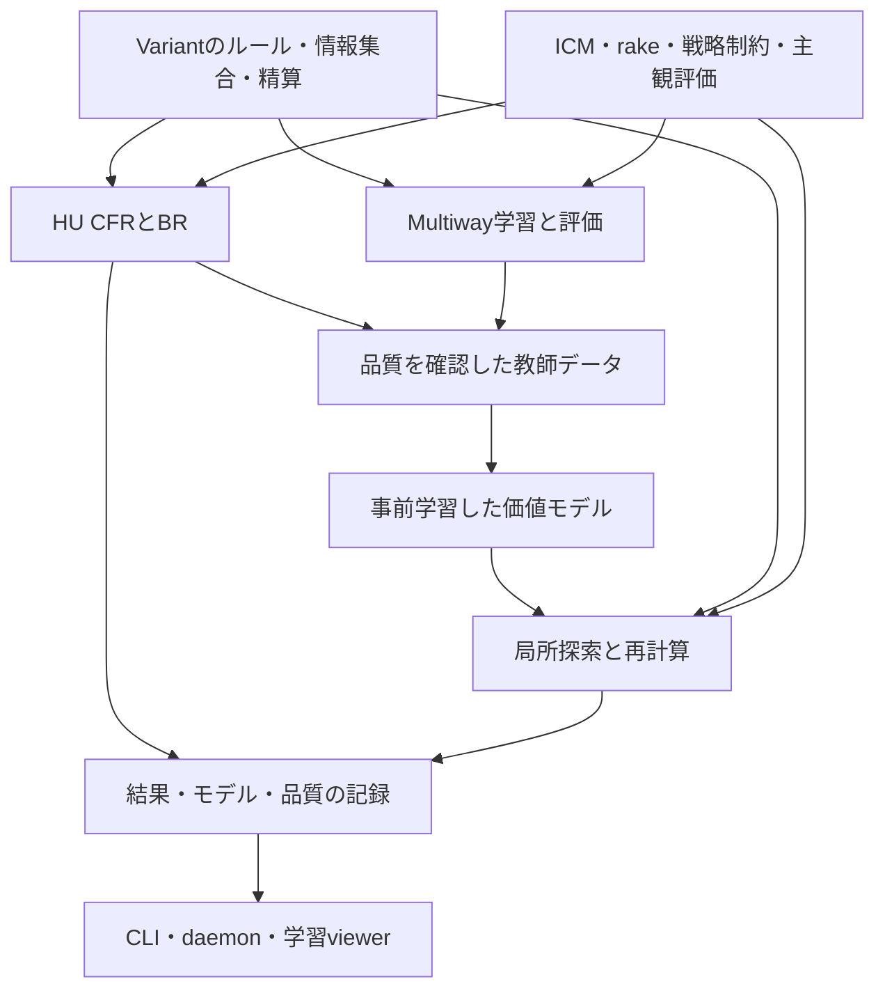

# ポーカーソルバー: 全体方針とロードマップ

更新: **2026-09-25**。方針: **HU Postflopの厳密CFRから開始。GTO Wizard比較とExploitabilityを検証の軸にし、通常規模の計算はローカルで進める**。
一般化は初期設計から進め、Multiway PostflopとPKOは低優先。通常サテライトは共通ICMの賞金配分として扱う。
現状・研究・競合の根拠は[差分と調査](research/solver-roadmap-survey-2026-09-20.jp.md)を参照。
費用の前提と概算は[クラウド費用見積もり](research/solver-cloud-cost-estimate-2026-09-20.jp.md)を参照。
各段階の機能要件・作業ID・依存関係・完了条件は[実行計画書](plans/solver-implementation-plan.jp.md)に分けて記載する。
初回の比較セットと計測手順は[HU Postflop検証計画](validation.jp.md)を参照。
R0の着手順・手順・成果物・完了条件は[R0実行計画・作業票](plans/r0-execution-plan.jp.md)に起票した。

## 1. 最終目標と今回の方針変更

利用者が指定した最終目標は次の3本である。

1. **あらゆるポーカーバリアントへ対応を広げる。**
2. **ML等を用い、Multiwayを含むPreflop / Postflopの妥当な近似解を数分以内に提供する。**
3. **HUでは、厳密なCFR計算に基づくGTO解を提供する。**

横断機能として、多人数ICM近似、Nodelock、特定条件でEVを過大・過小評価するプロファイルを目指す。
この3機能は利用者の希望であり、初回リリースへの必須組合せ・詳細な意味は下の決定表で固定する。

従来の「Multiway Preflopをローカルで一晩計算する」は最終的な利用体験から置き換える。
長時間計算は教師生成・検証・高精度再計算に利用できるが、それを数分の提供目標の達成とは数えない。
個人学習という既存の用途を引き継ぐ。公開サービス・課金・共有の要否は別判断である。

2026-09-20のヒアリングで、次の方針を確認した。

- **厳密CFRを先に優先する。** 単独で使える計算機能として整え、その品質を確認した解を高速近似MLの教師データにも使う。
- **最初はHU Postflopとする。** NLHEの既存経路を出発点にし、Preflopからの全ゲーム完成を最初のML学習の前提にしない。
- **必要な抽象化を使う。** ベットサイズを選択し、variantや規模に応じてハンドも抽象化できる。設定した抽象ゲーム内のCFR残差と、元ゲームに対する抽象化の影響を分けて評価する。
- **クラウド利用と長時間の事前学習を許容する。** 数分の目標は学習済みモデルを使う際の待ち時間に適用し、教師生成・学習時間と分ける。具体的な資源と費用上限は、見積もりを見て利用者が決める。
- **EVプロファイルは主に相手の誤認を表現する。** 相手が特定条件の価値を過大・過小評価する戦略を作り、実際のルールでのEVと対策を調べる。本人のリスク選好は主対象にしない。
- **Multiway Postflopの優先度は低い。** 最終目標には残すが、HUの初回完成や高速近似の最初の受入条件にはしない。Multiway Preflopは別の対象として扱う。
- **バリアント対応はなるべく一般化する。** 「NLHEの次はPLO」と固定せず、ルール・情報・賭け方・精算を共通化できる設計を初期から検証する。
- **PKO等は低優先とする。** 通常MTTのICMと同額チケット型サテライトを同じ賞金配分モデルで扱い、bounty固有の拡張は後段に置く。

2026-09-21に、R0の具体化について次を確認した。

- **GTO Wizardの既存解を外部比較に使う。** 日常用5〜10シチュエーション、大きな改造後用20〜30シチュエーションを、Rake・stack・Preflop Action等が多様になるよう選ぶ。条件を揃えたEV・戦略の比較と自作solverの品質評価を組み合わせる。
- **高速近似の初回出力は1ノードの各action EVでよい。** 全ゲーム木の返却や戦略頻度の表示を、その最小出力の必須条件にしない。hand別・range集約の粒度と値の基準は設計時に明示する。
- **「数分」は実現可能性を調べる目標値。** 現時点では提供保証や固定の合否条件にしない。
- **HU Postflop厳密計算の品質指標はExploitabilityを基本とする。** 数値の閾値は未固定。高速近似・Multiway等の評価方法は、広い研究調査を踏まえて該当段階で決める。
- **極端に重くない計算はローカルで実行してよい。** 初期計測から資源量を見積もり、長時間・大量計算や有料クラウドは規模と費用を別に判断する。

本書はプロダクトの優先順位と受入条件の入口であり、**新しいTOML項目、runtime、既定値、成果物形式の導入ではない**。
現行契約は[HU等の規範](solver-config-v1.jp.md)と[Multiway規範](multiway-preflop-v1.jp.md)が正本。
実装時には規範、実装guide、parser/runtime、CLI、user guide、test、例、metadataを同じ変更で同期する。

## 2. ヒアリングと決定台帳

未回答を合意に置き換えない。確認済みの方針と、詳細を詰めるための提案を分ける。
優先順、HU Postflop先行、必要な抽象化、実行環境と事前学習、profileの主対象には回答を得た。
Multiway PostflopとPKOは低優先、variantは一般化を優先する方針も確認した。
通常規模のローカル計算は実行可。有料資源は見積もり後に判断する。残る数値・画面・profileの詳細は下表を起点に具体化する。

| ID | 明確化する事項 | 現在の状態 / 初稿の提案 | 決まる設計 |
|---|---|---|---|
| D1 | 最初の利用価値と順序 | **確定**。厳密CFRを優先し、品質確認済みの解を高速近似MLの教師にも使う | HU厳密計算の受入→教師生成→高速近似という主工程。最初に受け入れるHUの範囲はD4 |
| D2 | 数分の対象 | **確定**。高速近似は1ノードの各action EVが最小出力。「数分」は努力目標 | 全木返却を初回要件にしない。値の粒度・単位、入力から返却までの時間を設計・測定 |
| D3 | ローカル / クラウド、GPU・RAM、学習費用 | **方針確定**。極端に重くないローカル計算は実行可。クラウド可、事前学習は長時間可。有料枠は見積もり後に判断 | 初期実測からCPU/GPU/RAMと規模を決定。計測・教師・学習・通常利用の費用を分離 |
| D4 | HUの厳密性と初回範囲 | **方針確定**。HU Postflop、必要なbet/hand抽象化。GTO Wizard比較を日常5〜10件・拡張20〜30件、多様なRake/stack/Preflop Actionで構成 | 同じ条件の有限ゲームを比較。具体的な参照局面・条件・許容差を検証計画で固定 |
| D5 | Multiway Postflopの優先度・人数 | **低優先で確定、人数は後段で決める**。最初の検証を小3人ゲームとするのは実装案。Multiway Preflopの優先度と一括しない | 任意Postflop開始の製品化を後段へ。Preflopに必要な多人数継続評価は別に検証 |
| D6 | EVプロファイル | **主対象は確定**。主に相手の価値の過大・過小評価。具体的な条件と歪め方は未確定 | 相手の主観評価と客観EVの分離。行動incentiveで表すか、belief/継続価値を変えるか |
| D7 | バリアントの増やし方 | **一般化を優先する方針で確定**。次をPLO4等に固定せず、性質の異なる小ゲームで共通設計を検証 | 共通ゲーム境界、公開/私的情報、手札数・交換、NL/PL/FL、split pot。実用packの順序は検証結果で提案 |
| D8 | ICM対象 | **方針確定**。通常MTTと通常サテライトを共通ICMで扱う。PKO等は低優先。field規模の数値基準とFGSの時期は未確定 | 任意の非増加payout、卓外field、平坦payoutの検証。bountyと将来handの計算は独立拡張 |
| D9 | 妥当な精度 | **HU厳密計算の指標は確定: Exploitability**。その閾値は未定。後続の近似系等は広い研究調査を踏まえて決める | HUのBR定義・rake時の集計を明示。後続指標をR0で固定せず、各方式の比較前に採用理由と基準を記録 |
| D10 | 最初からGUIが必要か | **回答待ち**。CLI/daemonを再利用し、薄い学習viewerを段階的に接続する案 | 最初に使える成果物と、UI作業の順序 |

D2の最小出力と目標の扱い、D9のHU厳密計算の指標は決まった。
「数分」はNN単体の推論時間ではなく1ノードのaction EVを利用できるまでの待ち時間として測る。
GTO Wizardとの比較は入力・木・値の基準を揃え、同程度のEVを持つ混合戦略の頻度差だけで不合格にしない。

HU Postflopの最初の工程は具体化できる。D4の抽象化粒度は、品質・速度・メモリの比較から実装側で提案する。
具体的な参照ケース、値の粒度、HU品質の閾値、GUIの初回範囲、profileの例は対応作業で詳細化する。
後続段階の人数や実用variantの選定を、HUの仕様・費用見積もりの待ち条件にはしない。

## 3. ロードマップの出発点と主な差分

以下は2026-09-20の調査に基づく出発点。作業の現在の状態は[Linear](status.jp.md)、現行実装はアーキテクチャと規範を確認する。

| 領域 | 既存の資産 | 目標との差分 |
|---|---|---|
| HU Postflop | vector CFR、BR、独立oracleとの比較、lossless suit処理、`.sol`と値照会 | exactの適用範囲・数値残差の受入セット、stack等の表現、Nodelockとprofile |
| HU Preflop | 169-class trunk、equity-showdown / bucketed継続 | 全ゲームの厳密計算ではない。継続モデルの近似を明示した別品質区分が必要 |
| Multiway | 2〜9席、side pot、個別stack/range、MCCFR、EHS²/current-street | 安定した戦略品質の証拠、任意Postflop開始、数分での提供経路 |
| ICM | field15人以下exact、16人以上Monte Carlo、入力上限10,000人、同額payout、HUへのtournament-icm接続 | 大規模性能・精度の独立受入、prepared経路の卓外stack圧縮の検証、賞金差の誤差管理、既存HU経路の品質認定 |
| ML | 継続価値を差し替える発想と、生成型ゲームの資産 | range条件付きvalue境界、教師、学習、推論、model registry、分布外判定を新設 |
| Variant | evaluator依存と私的状態の次元遷移 | rules、観測、情報集合、betting、showdown、精算、range/UI、検証をvariant単位で実装 |
| Lock / profile | tree script、utility/rake、継続モデルの係数 | strategy制約と主観評価の別レイヤ、客観EVの再評価、未来への伝播 |
| 運用・表示 | CLI/daemon、cancel/resume、query、成果物 | GUI、Multiway保存契約の不一致、未学習・近似・品質確認範囲の表示 |

[調査資料のコード対応表](research/solver-roadmap-survey-2026-09-20.jp.md)に根拠を記録した。
実験時はHEADだけでなく、dirty差分・必要な未追跡入力を含むsourceとbinaryの識別を残す。
過去のtest成功は当該snapshotの証拠であり、新しい作業の受入へ自動的に流用しない。

特に解消すべき既知の境界は、弱いdeviatorで小さな検出利得を得ても収束とは言えないこと、
`.mwsol`のPreflop-only規範とwriterの出力範囲が不一致であること。
retention-gated fitの実装・保存済み検証は存在するが、実ゲームでの品質改善・既定採用まで認定されたわけではない。
根拠: [品質総括](../experiments/multiway-2026-09/quality-decision.md)、[現行実装guide](multiway-preflop-v1.md)。

## 4. 解の種類と抽象化の扱い

| 種類 | 計算内容 | 言えること / 残るもの |
|---|---|---|
| **HU CFR基準解** | 明示したベット・カード抽象化で定める有限ゲームを、ML leafなしのCFRと対応するBRで評価 | 2人零和・perfect recall等の適用条件を満たすゲーム内で残差を測る。有限反復・浮動小数誤差と、元ゲームに対する抽象化の影響は別 |
| **高速近似解** | 学習済みvalue/policyと局所探索、必要に応じsampling | 指定の学習・検証領域での実用精度。NN lossや局所CFR残差だけで全ゲームの均衡誤差は保証しない |
| **条件付き戦略** | Nodelock、行動incentive、効用/認知モデルを適用 | 制約下の応答や修正ゲームの戦略。元ゲームのGTOとは区別し、元utilityでのEVを併記する |

CFRは通常、有限時間で厳密な有理数のNash解を返す方式ではない。
今回の方針では、**設定した抽象ゲームをCFRで計算し、そのゲーム内の残差を測る**。
ゲームの抽象化を許容することと、CFRの価値・regret計算をNNに置き換えることは別の選択である。
初回NLHE Postflopは既存のcombo単位・全カード継続とlossless同型併合を基準にし、必要なベット候補を選ぶ。
ハンド抽象化も必要性に応じて使えるが、同型併合と情報を失うbucket化を区別して表示する。

抽象化は、対象action、hand/bucket写像、chance確率、履歴の保持、terminal payoff、元handへの戦略の戻し方まで定義する。
特定のベットサイズだけを許すBRは、それ以外のサイズからの逸脱を評価していない。
ハンドをまとめたゲーム内の小さい残差も、元hand単位での小さい誤差を意味しない。
ベット候補を増やす・bucketを細かくする対照計算と、可能な小ゲームでの非抽象化評価を別に持つ。

ハンドや履歴の統合でperfect recallを失う場合は、標準CFRの保証を自動適用しない。
厳密な保証を付ける経路ではperfect recallを保つ設計か、該当する抽象化の保証条件を確認する。
条件を満たせない方式は実証的な近似として区別する。
[不完全記憶とCFRの原論文](https://arxiv.org/abs/1205.0622)。

HUでも可変rake、卓外fieldを含むICM、profileの効用変更では一般和になり得る。
残り2人だけの通常ICMはstackのaffine変換だが、2人がhandを争っていることだけでは零和とは限らない。
一般和やMultiwayにも均衡はあるが、2人零和CFRの平均戦略収束保証を転用しない。
[理論の境界](https://arxiv.org/abs/1305.0034)、[現行規範](solver-config-v1.jp.md)。

## 5. 目標構成

以下は実装方針案であり、既存crateを全面的に置き換える計画ではない。

- **共通ゲーム境界:** deck、private/public deal、観測、legal action、terminal settlement、utilityを定義する。NL/PL/FL、Omahaの使用枚数、Hi-Lo、Studのupcard、Drawの交換履歴を扱える構造をR1から検査する。
- **専用計算経路:** HU vectorとN人samplingの長所を保つ。HUの`PerPlayer<T>`を機械的にN人へ広げない。`cfr-ref`は凍結し、本番実装との独立性を保つ。
- **価値推定の境界:** boardだけでなく、各seatのbelief/range、履歴、stack、pot/side pot、legal action、utility、profile、モデル適用範囲を渡す。card removalとbunchingの整合性を検証する。
- **事前学習:** 自作の品質確認済み解から開始し、モデルを条件付きにする。通常均衡だけの教師を、任意profileやICMにそのまま転用しない。
- **逐次再計算:** 履歴の制約と到達価値を保持する。単に現在rangeを固定して解き直す処理を「安全な再solve」と呼ばない。HUでの理論とMultiwayでの実証を分ける。
- **保存:** game/tree、抽象化の方式・粒度・写像の識別子、utility、lock/profile、solver、model、学習データ、seed、source/binaryの識別子、解いた範囲とqualityを結果に紐付ける。未計算ノードへ黙ってuniform/GTOを補わない。

採用の第一候補はNNの継続価値＋局所CFRである。
Deep CFR系はregret自体の近似という別軸で、比較候補として残す。
DeepStack、ReBeL、Pluribus、2026年のneural CFR研究との対応と適用限界は[調査資料](research/solver-roadmap-survey-2026-09-20.jp.md)に記録した。
既存`PostflopModel`は3係数の狭いAPIであり、NNを差し込むだけでこの構成が完成するわけではない。

HU厳密解はHUの教師と学習系の検証基準になるが、Multiwayの正解labelを直接与えるものではない。
Multiwayには人数・joint belief・side pot・utilityに合う教師生成と独立評価が必要であり、R5/R6の別条件として扱う。

### 一般化を初期から検証する境界

目標はルールを共通部品・定義の組合せで記述し、CFR、教師生成、評価、保存の仕組みを再利用できること。
共通化の範囲は次の性質で検査する。NLHEの2枚の手札・共有board・4 streetを全variantの前提にしない。

| 境界 | 表現するもの | 小さい検証対象 |
|---|---|---|
| カードと進行 | deck、配札、手札数、交換、公開/非公開、任意のphase列 | 共有board型、Studのupcard、Drawの交換 |
| 情報集合 | 各プレイヤーの観測と私的履歴、捨てたカードの記憶、到達belief | 同じ公開状態でも過去の私的情報が異なるケース |
| 行動と抽象化 | NL/PL/FL、raise cap、bring-in、交換action、bet/handの抽象化 | pot-limit上限、fixed-limitのraise数、異なる手札次元 |
| 役と精算 | 使用枚数、high/lowの役順、split pot、side pot、同着 | Omahaの2枚使用、Hi-Loのquartering、複数winner |
| 計算と成果物 | game/abstraction ID、行動とhandの対応、値の単位、quality、model適用範囲 | 同じ生成・保存・照会経路で性質の異なる小ゲームを往復 |

R1/R2では既存NLHEに加え、Stud系とDraw系等の縮小ゲームで共通境界を試す。
これは実用サイズの全variantを完成させる条件ではなく、設計が異なる情報構造を表せるかの受入である。
共通の定義・評価・保存を持ちながら、重い計算にはHU vector等の専用kernelを残せるようにする。
ゲームを追加できることと、同じNNの重みで未学習variantを解けることは別に認定する。
次の実用variantは固定せず、共通部品で対応できる範囲・検証結果・計算費用から選ぶ。

### 通常MTTとサテライトの共通ICM

通常の同額チケット型サテライトは、上位K人のpayoutを同じチケット価値T、それ以下を0とした
`[T, T, ..., T, 0, ...]`として通常MTTと同じICMに入力する。別のサテライト専用ICM方式は必須にしない。
ICMは全員のstackと順位ごとの賞金から価値を計算し、公式サービスでも同額チケットの例に同じモデルを使っている。
[ICMの定義](https://support.icmpoker.com/en/articles/3699969-what-is-the-icm-model)、
[サテライトの実例](https://www.icmizer.com/en/blog/top-6-pitfalls-to-avoid-when-analyzing-tournaments-in-icmizer/)。

現行[ICM実装](../crates/multiway/src/icm.rs)の入力検証は同額payoutを許容する。
追加するのは平坦payout、bubble、資格獲得が確定した状態、同一handでの複数脱落の精算などの受入ケースである。
HUには`tournament-icm`の公開入力とruntime接続が既にある。新規接続ではなく、平坦payout・賞金EV・大規模性能の認定を残作業とする。
根拠: [HU規範](solver-config-v1.jp.md)、[utility実装](../crates/cli/src/economics.rs)。
卓外fieldを含むICMはhand内がHUでも一般和になり得るため、chipEVの零和保証と区別する。
FGS等の将来handの精密化は通常MTTにもサテライトにも関わる独立拡張であり、通常サテライトの受付条件にしない。
固定の順位賞金で表せない特殊形式を追加するときは、そのルールに沿ったutilityを別途定義する。

## 6. 「数分」と「妥当な精度」の受入設計

### 時間と資源

**「数分」は研究開発の目標値であり、現時点の提供保証・固定の合否条件ではない。**
初稿の「通常1〜3分、P95で5分」は参考値として残すが、利用者の合意済みSLOやruntime既定値と扱わない。
高速近似の最小出力は**1ノードの各action EV**。入力確定からvalidation、準備、計算、通常の品質確認を経て値を利用できるまでを測る。
値の単位・基準・対象hand/range・未計算actionを明示し、永続保存や全木exportの時間は別区間でも記録する。
後続ノードの計算や戦略表示を追加する場合は、その品質と待ち時間も別に測る。

| 測定枠 | 必須の記録 |
|---|---|
| cold / warm | 初回modelロード・cache構築と、通常ケースを分ける。モデル作成費用をwarm時間に隠さない |
| online | CPU/GPU型番、threads、RAM/VRAM peak、入力domain、P50/P95、timeout/OOD率、後続node待ち時間 |
| offline | 教師生成のCPU/GPU時間、学習時間、disk、model容量、実費、再学習単位 |
| 高精度計算 | CFR基準計算や追加計算の時間・停止残差。高速近似とはmode別に記録し、数分目標の達否を区別 |
| 資源超過 | 対応範囲外・未判定・時間切れを明示。menu削除、人数制限、近似切替を黙って行わない |

`run.resources.memory`はarena上限であり、process全体のRAM上限ではない。
通常規模のローカル計算は2026-09-21に実行可と確認した。少量の試行で時間・peak RSS等を測り、極端に重い計算へ無制限に拡大しない。
クラウド利用と長時間の事前学習も確認済みであり、ローカル機の性能だけで将来の対象規模を制限しない。
CPU中心の厳密CFR・教師生成と、GPUを用いる学習・推論について、対象CPU/GPU/RAMと費用をD3で具体化する。
旧研究の「9月のクラウド費用$20未満」は過去の実験条件であり、新しい教師生成・学習の上限とは扱わない。
有料資源について利用者は**見積もりを見て予算を決める**。2026-09-20の公開料金に基づくクラウド利用時の資源枠案は、HU計測が約$55〜200、
その後の限定HU教師・ML実験が別途約$355〜1,655。いずれも税・開発工数を除く、仮定した利用時間の概算である。
製品完成までの費用や必要学習量を保証する数字ではなく、時間の仮定・単価・予備費を[費用資料](research/solver-cloud-cost-estimate-2026-09-20.jp.md)に記録した。
通常検証のローカル実測と教師1件の計測から、クラウドが必要な部分だけ再見積もりする。上記額は初回着手に必須の支出ではない。

### 品質

一般の戦略組合せをσとして、各seatの一方的変更の最大改善量を
`g_i = max_{σ'_i} u_i(σ'_i, σ_-i) - u_i(σ)`とする。NashConvはその合計。
2人零和でいうexploitabilityをNashConv/2とする場合は、定義・utility単位・分母のpotを結果に残す。
一般和で小さい正確なNashConvを測れれば有用だが、CFR自身にそこへの収束保証があるとは限らない。

HU Postflop厳密計算はExploitabilityを主指標とし、GTO Wizardの既存解との比較を外部対照にする。
action依存のrakeにより一般和になるケースはseat別の`g_i`とNashConvを報告し、`NashConv/2`も出す場合は集計定義を明示する。
同じBR評価を使えても零和での収束保証とは分ける。後続の高速近似・Multiway等の方法と閾値は、研究を広く比較して該当段階で選ぶ。
下表の後続指標は調査候補であり、R0で確定した受入方式ではない。

| 対象 | 合格に使う証拠 | 合格の代用にしないもの |
|---|---|---|
| HU基準解 | 同じfinite treeで全BR、oracle差分、numerics、保存後の誤差。候補値はNashConv/2 ≤開始potの0.1%、教師は0.02% | 有限反復で誤差ゼロという宣言。木の外のサイズ・カード近似誤差を含むという主張 |
| 抽象化 | action追加・hand分割による感度、小ゲームの非抽象化BR、元handへ戻した戦略の評価、情報とchanceの整合性 | 抽象ゲームのBRだけによる元ゲームのGTO認定。限定した逸脱探索から全逸脱の上界を主張すること |
| 高速HU（調査候補） | 返却action EVの誤差・順位・選択時の損失。戦略を構成する方式ならBR評価も比較。初稿のNashConv/2 ≤potの0.5%は方式選定前の参考値 | 1ノードの値だけから全木のExploitabilityを主張。予測MSEだけ、局所残差、基準解との頻度一致 |
| Multiway | 小ゲームの正確なseat別BR、実ゲームの独立deviator、fit強度の校正、held-out CI、seed/予算感度、全位置・深い枝のcoverage | 小さい有限候補gainをexploitabilityの上界とすること。対人勝率だけのGTO認定 |
| ICM | 独立exact計算、large-field高予算MCとの比較、卓外stack圧縮の影響、賞金価値とaction差分のCI、平坦payout・脱落・同着の照合 | chip単位の閾値の流用。ICM sampling・field圧縮・戦略誤差の混同 |
| lock / profile | 固定確率・総頻度の違反量、無効化時の基準一致、独立した客観EV、適用horizonの照合 | incentive込みの値を実利益として報告すること |
| 新variant | legal action、観測の同値性、chance確率、showdown、精算の独立oracle、小さいゲームでのsolve照合 | evaluatorが役を判定できることだけでsolver対応とすること |

HU厳密計算の数値は**基準測定後、候補比較の前に固定する提案値**であり、既存stop targetを変更しない。
後続の指標・閾値は研究調査と対象方式に基づき各段階で決める。ICMとMultiwayもR0で数値を固定しない。
低い検出利得から未探索の逸脱利得を上から抑えられるわけではない。評価器が弱い場合は未判定とする。
元のutilityと制約下utility、許す逸脱の範囲を変えた結果も混ぜない。

誤差は、ゲーム木の制約、lossy card abstraction、CFR残差、NN継続、ICMの数値近似、ICMモデル自体、保存の量子化に分けて追う。
独立性や誤差境界を示さずに足し合わせて「総合精度」としない。
学習/検証はboardだけを無作為分割せず、同型board、range生成元、stack/payout、tree、抽象化、profileのまとまりで分離する。
異なる抽象化の教師を同一条件の厳密labelとして混ぜず、元handへ戻す方式と品質区分を記録する。
分布外のstack・range・賞金・profileは、追加計算か未対応表示へ送る。

### 初回の代表ケースと後続候補

HU PostflopはGTO Wizardの既存解から**日常5〜10件、大きな改造後20〜30件**を選ぶ。
日常8件を拡張24件に含める構成を実装案とし、Rake（率・cap・適用条件）、stack/SPR、Preflop Action、位置、street、boardを分散する。
HUはPostflopに残った人数を指し、6max等のPreflopからHUになった局面も対象とする。
参照URL、両者range、木、EV基準等を記録し、一致条件が不足する局面は参考比較と区別する。
頻度・EVの許容差は参照表示の丸めとCFR残差を踏まえて決める。[選定と比較手順](validation.jp.md)。
小規模の独立oracle fixtureはこれらと別に維持する。参照セットは未取得・未測定であり、以下の後続候補を初回の必須セットにはしない。

| ケース群 | 含める条件 |
|---|---|
| HU基準 | River / Turn / Flop、SRP / 3bet pot、複数size、suit非対称range、少数comboの独立oracle |
| 抽象化対照 | ベット候補の追加、hand/bucketの細分化、card removal、履歴保持、元handへの戦略展開とEV再評価 |
| NLHE近似 | chipEVとrakeの別case、2/3-way Postflop、2/6/9席Preflop、20/50/100bb等のstack候補、limp・cold call・深いreraise |
| ICM | 同一treeのchipEV対照、非対称stackのFT、同額チケット型サテライト、15/16人の切替境界、100/1,000人と10,000人の資源screen |
| 相手モデル | combo lock、部分lock、総頻度lock、複数seat、条件付きの過大・過小評価、horizonの内外 |
| Variant設計 | PLOの手札2枚使用、Hi-Loのquartering、Studのupcard/bring-in、Drawの交換枚数と私的履歴を含む小ゲーム |

頻度の平均だけで不良caseを隠さず、case/seat/street別の最大・分位点・未判定数も表示する。
ICMの10,000人入力を受け付けることと、同じ範囲を数分で解けることは別の到達条件である。

## 7. 到達条件で区切るロードマップ

**厳密CFRを優先し、その解からMLへ進む大順序は確定**。各段階の対象範囲・数値・機能の組合せは提案である。
一般化はR1から進め、Multiway PostflopとPKOは後段に置く。ICM・相手モデルをMultiwayの完成待ちにしない。
日付の約束は、初回対象・受入基準・費用枠と最初の計測結果を固定してから更新する。
旧P0〜P4と混同しないため、今回の段階はR0〜R7とする。

| 段階 | 利用者に届く結果 | 主な実装・研究 | 完了条件と次段階への依存 |
|---|---|---|---|
| **R0: 対象・精度・資源を具体化** | 1ノードのaction EVを目指す方針と、HU検証の進め方が明確 | 5〜10/20〜30件の比較セット設計、Exploitabilityの定義、計測区間、ローカル資源とsource特定 | 対象表・測定計画・未決台帳が揃う。方針回答だけで参照セット取得やR0作業完了とはしない。有料予算は利用前に判断 |
| **R1: HU検証と汎用ゲーム境界** | 計算したゲームと残差を信頼でき、異なるvariantを表せる設計を持つ | HUのルール・情報集合・EV単位・全BR、独立oracle、数値安定性、保存、資源計測。Stud/Draw等の縮小ゲームで共通境界を検査 | HUの正当性を独立照合。異なる情報・phase・精算を表現し、抽象化とゲーム内残差を分けて記録 |
| **R2: HU Postflopの厳密CFRを実用化** | NLHEのRiver / Turn / Flop開始を設定・計算・保存・照会でき、ML教師の出所になる | 既存CFR/BRを受入fixtureで認定し、必要なtree/入力範囲を整備。教師用のrange・hand別価値・残差・抽象化を設計 | 選定Postflop条件の残差と保存後の誤差が基準内。教師の意味・再現性・抽象化感度を確認。HU Preflop全ゲームは完了条件に含めない |
| **R3: HU教師生成・学習・局所探索** | 品質を確認した厳密解を教師として、限定HUの1ノードの各action EVを返せる | 近似系評価の研究調査と方式選定、R2認定教師、range条件付きvalue、batch推論、局所探索等の比較 | 選定した指標で品質を認定し、held-outで時間・RAM/VRAM・費用を測る。数分目標の達否は別記し、未達を隠さない |
| **R4: ICM・Nodelock・相手profile** | 通常MTT・サテライトのHU局面で相手傾向を変え、客観EVを比較できる | 既存ICMとHU接続の品質・性能認定、field表現、総頻度lock、profile条件付きvalue、基準計算と高速経路への統合 | ICM数値・field圧縮・戦略誤差を別検証。平坦payoutを同じ計算経路で扱い、lock/profileの適用範囲を説明できる |
| **R5: 共通基盤でvariantとPreflopを広げる** | 共通の入力・計算・成果物から対応ルールと開始局面を増やせる | R1の境界を実用サイズへ広げ、game定義、役評価・精算、抽象化、必要な専用kernel/modelを追加。HUと多人数Preflopは別domainで検証 | 追加対象ごとにルール、教師、OOD、速度/品質、保存、viewerの証拠がある。多人数Preflopには独立した継続価値の品質認定が必要 |
| **R6: Multiway Postflop（低優先）** | 複数人が残る任意Postflop局面を高速に解ける | 小3人ゲーム→River→Turn/Flopから人数を広げる案。joint belief/card removal、side pot、独立deviator、品質確認済み教師 | 採用した人数・条件で時間・品質・coverageを同時に満たす。制限を表示し、少人数の認定を全人数へ流用しない |
| **R7: 特殊大会と追加の精密化** | PKO等のbounty形式、将来handのモデル、特殊ルールへ拡張 | bounty精算と継続価値、FGS、追加variantの境界。PKOは低優先、他は必要性と費用で選ぶ | 各方式のutility・理論条件・実証範囲を個別に認定。通常MTT/サテライトやHUの完成条件に一括して含めない |

主工程は**R1の汎用境界と検証→R2のHU Postflop厳密CFR→R3の教師生成とHU高速近似**とする。
R4でICM・相手モデルを統合し、R5で共通基盤から対象を広げる。Multiway PostflopとPKOは低優先のR6/R7へ置く。
学習の入出力設計や小ゲームの予備研究は先にできるが、未認定のCFR出力を正解として大量生成しない。
最初のHU範囲はPostflopで確定しており、その受入でR3へ進む。HU PreflopのCFR範囲拡張は後続の独立課題とする。
全バリアントの厳密計算が完成するまでMLを始められない、という依存は置かない。

combo/部分Nodelockと相手profileの最小版はR2以降に追加する。客観EVとの分離、制約遵守、再solveを独立照合する。
これらとGUIの全機能を、通常HU教師生成の一律の前提にはしない。profile付き教師には対応機能の検証を前提とする。
ICMの数値検証とprofileの意味定義は早期に進め、R4まで設計を延期しない。
`.mwsol`の保存契約、Multiwayのdeviator校正・retention限定screenはR5/R6の多人数教師生成に先立つ必須作業とし、
HUに影響しないMultiway固有の未達をR2の待ち条件にはしない。
通常のHU高速近似はR3、ICM・lock/profileを含む高速近似はR4として到達条件を分ける。
PKOを通常ICMの教師生成に先立つ必須依存にはしない。

Multiway Postflopの低優先化は、任意のPostflop開始を使える製品機能についての方針である。
多人数Preflopを近似するために必要なPostflop継続評価は、R5の内部機能として先に検証する場合がある。
HUの教師だけでその継続を置き換えず、対応人数・許す継続・抽象化を明示する。

viewerはR2で既存の解と品質を読める最小版、R3/R4で逐次solve・比較・相手モデルの操作へ広げる。
GUIを最初から必須とするかはD10で変更できる。品質研究中でも、保存契約が閉じた範囲の閲覧改善は進められる。

「全バリアント」は終わりのない一括実装にせず、**ルール対応 / CFR計算対応 / 高速近似対応 / 精度認定 / UI対応**の表で管理する。
NLHEを最初の実用基準にし、PLO4/5/6・Short Deck・FL/Hi-Lo・Stud/Draw等は共通性と検証結果から追加する。
異なるゲームを混ぜた大会、複数board、特殊なjoker/side betも必要なら別packとして定義する。
Stud/Draw/Hi-Lo等の性質はR1の共通化検査に使うため、その設計を長期段階まで先送りしない。
全variantの実用モデルを先に学習することはしない。

## 8. NodelockとEVプロファイルの仕様案

### Nodelock

最小版は`σ_i(action | information set)`を固定する機能とする。
node全体、特定combo、特定actionの部分固定を区別し、残余確率をどう最適化するか定義する。
複数node/seatの制約、到達率0のnode、違法action、矛盾する制約、保存後のtree編集を扱う。
木の枝を消すことをlockの代用品にしない。

総頻度lockは、hand別確率の単純平均ではない。どの到達rangeで重み付けするか、
上流戦略が変わるときに重みを更新するか、許容誤差はいくらかを仕様にする。
「固定した相手全戦略への最大応答」と「一部lockを守る双方の再最適化」は別modeとして扱う。
評価も制約付きBRと元ゲームで自由に逸脱するBRを区別する。

### 条件付きEVプロファイル

| モデル | 例 | 設計上の意味 |
|---|---|---|
| 行動incentive | 特定streetのdrawでcallを好む、弱いpairでfoldを嫌う | action価値へbonus/penaltyを加え、主観的に再最適化する最小方式 |
| belief/価値の誤認 | 相手のbluff率やdrawの完成価値を過大評価 | beliefsまたは継続価値を歪める。incentiveと同じ心理モデルとは断定しない |
| 効用・リスク選好（主対象外の拡張） | 本人が賞金期待値よりバスト回避を重視 | terminal utilityを変更。ICMそのものと個人的なリスク選好を区別する |

**主対象は相手の誤認で確定した。** 最小の実装候補は行動incentiveだが、これで意図した誤認を表せるかは具体例で決める。
例えば「drawのcallを好む傾向」と「drawの完成確率を高く見積もる」は同一仕様と扱わない。
条件はseat、street、公開履歴、board、そのプレイヤーが知るhand特性等に限定する。
相手の実hole cardや未来のrunoutを見て判断できるモデルにしない。

客観的なutilityを`u`、主観値を`u_tilde`として別に保持し、
**戦略を作る値と、その戦略を実際のルールで評価するEVを分離する**。
例えば「FlopでFDを持つseatのcallに現在potの3%相当を加算」は行動incentiveの仕様候補であり、
確定した設定構文ではない。ICMの賞金utilityへchipの3%をそのまま足すことはできない。
賞金額・賞金総額比・明示した変換方式のどれを採るかを別途定義する。

加算/倍率、基準pot、nodeごとかpathで一度か、条件重複の合成、適用street/horizon、lockとの競合を明示する。
全actionに同じ正の倍率を掛けるだけなら選好が変わらない場合もあるため、期待した傾向が生じるか小ゲームで検証する。
hard lockを先に満たし、profileは自由な部分に作用させる案を基本にする。
profileを適用した相手がこちらへ再適応する設定と、生成した相手戦略を凍結して対策を解く設定も区別する。

高速系では「先読み内だけ有効」「street内」「hand全体」の違いを結果に残す。
先読み外を通常GTOのNNで評価するなら、全handで同じleakを仮定した最大搾取解とは表示しない。
このhorizon問題は[商用の公開技術説明](https://blog.gtowizard.com/gto-wizard-ai-custom-multiway-solving/)でも確認できる。

## 9. 研究を閉じる判断点

| リスク | 先に行う検証 | 失敗・未判定時の次手 |
|---|---|---|
| 現在のMultiwayを教師にすると弱点も学習する | 独立小ゲーム、強度を上げたdeviator、追加予算とseed、モデル差の分離 | 教師domainを縮小。大量生成を始めず、評価器または教師方式を直す |
| NN lossは低いが再solve後の判断が悪い | 同一gameで返却戦略のBR/EV loss、稀なrangeと境界hand、OODを評価 | 入力・sampling・horizonを変更。単純蒸留、cache、長い局所探索とも比較 |
| lock/profileがNNの学習範囲を外れる | 条件付きheld-outと、明示的な深いsolveを対照にする | profile条件付き学習、対応範囲の限定、低速再計算 |
| ICM評価を繰り返すと数分を超える | prepare/cache/batchを含む時間とaction差分CIを測る | 数値近似を改善。fieldを黙って縮約しない |
| variant共通化でHUが遅くなる | 代表HUの性能と新variant小ゲームの正当性を同時に確認 | 共通化をcold path/DTOに限定し、専用kernelを保つ |
| 学習費用が予算を超える | 小pilotで教師1件と学習単位の費用を測り、全体へ外挿する | domain/modelを絞る。費用上限を自動的に増やさない |

比較は「実装 → 限定pilot → 独立確認 → 採用/保留/却下」で閉じる。
同時に動かすアルゴリズム候補を増やしすぎず、各作業に目的・仮説・予算・成功/中止条件・sourceを残す。
新しい論文があるという理由だけで既存経路を置き換えない。
数分での品質が成立しない場合は、対象・horizon・資源のどれが制約かを報告し、未達のまま扱う。

## 10. 実行計画と作業状態への入口

作業の現在の状態・担当・依存・ブロッカーは[Linear](status.jp.md)で管理する。
具体的な手順・成果物・完了条件は[全体実行計画](plans/solver-implementation-plan.jp.md)と[R0作業票](plans/r0-execution-plan.jp.md)を参照する。
このロードマップには個々のIssueの進捗を転記しない。

目標、利用者の決定、段階別受入条件を変えるときは本書と該当計画を更新する。
公開契約やcodeの変更は[AGENTS.md](../AGENTS.md)と[development.md](development.md)の同期・検証に従う。
計画は`docs/plans/`、調査は`docs/research/`、保存証拠は[実験索引](../experiments/README.md)から辿れる場所へ置く。
