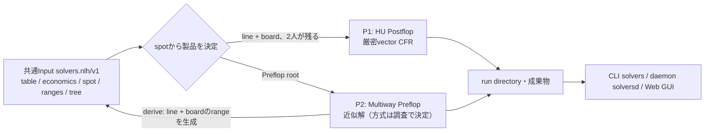

# 製品定義: NLH HU Postflop Solver / NLH Multiway Preflop Solver

更新: **2026-10-04**。本書は製品の目的・範囲・品質・到達段階の正本である。

2026-10-04の利用者決定により、旧ロードマップ（全variant対応・ML高速近似・Nodelock/相手profile、R0〜R7）を
破棄し、本リポジトリを**共通のInput形式を共有する2製品**として再構築する。旧状態はgit tag
`archive/pre-two-products-2026-10-04`で参照できる。作業状態は[Linear](status.jp.md)、
再構築の手順と目標構成は[再構築計画](plans/two-product-restructure.jp.md)、
共通Input形式は[`solvers.nlh/v1`規範](nlh-input-v1.jp.md)を参照する。

公開契約は[共通Input規範](nlh-input-v1.jp.md)、[P1規範](hu-postflop.jp.md)、[P2暫定規範](mw-preflop.jp.md)に従う。
未接続の挙動は各規範の実装境界に記す。旧family規範はM7の削除まで旧familyコードだけに適用する。

## 1. 利用者決定（2026-10-04）

| ID | 決定 |
|---|---|
| D1 | 製品は **P1: NLH HU Postflop Solver** と **P2: NLH Multiway Preflop Solver** の2つ。共通のInput形式を共有し、それぞれ独立に品質・性能を高める |
| D2 | 既存コードは2製品を前提とした新構成へ再構築する。検証済みの部品だけをレビューして移植し、それ以外はmainから削除する。旧状態はgit tagで残す |
| D3 | 共通Inputは、卓構成（人数・position・stack・blind/ante）、経済条件（rake/ICM）、range、ベット木の文法、単位（BB）を共有するゲーム記述とする。P1の開始局面はPreflop lineとboardで指定し、pot・stack・aggressorを導出する。P2の解からP1の入力を生成する製品間連携を持つ |
| D4 | 旧目標のうち **ICM（トーナメント）** と **GUI/daemon** を引き継ぐ。Nodelock、相手profile、ML高速近似、他variant、Multiway Postflop、PKOは対象外 |
| D5 | **P2の計算方式と出力品質の保証は未決定**とし、網羅的な調査と実験で決める |
| D6 | 共通Inputの細部（停止目標・木の既定、lineの表記、straddle、旧configの変換、P1のメモリ上限）は[Input規範](nlh-input-v1.jp.md)付録Aの決定に従う |

対象外とした項目は、新しい利用者決定なしに設計・実装へ戻さない。

## 2. 全体像

## 3. 共通部分

### 3.1 共通Input

- schemaは`solvers.nlh/v1`の1つ。ゲームの記述（`[table]` `[economics]` `[spot]` `[ranges]` `[tree]`）は
  両製品で同じ意味を持つ。計算の設定（`[solver]` `[output]`）は製品ごと、`[run]`は共通の運用設定。
- 製品はspotから決まり、利用者は製品名を書かない。boardなし → P2、boardありでPreflopを2人が通過 → P1、
  それ以外（Multiway Postflop等）は明示error。
- 卓は2〜9人で、position別のstack、SB・ante・BB ante、live straddle（re-straddleの連続を含む）を書ける。
- chip量の単位はすべてBB（内部は0.001 BBの整数）。旧P1のchip単位・`min_bet`は廃止する。
- P1の開始局面に至るlineは`BTN r2.5, BB c`形式の1通りの表記だけを受け、foldは書かない。
- strict・冪等・自己完結。未知key、他製品専用key、廃止keyはerror。正規化した実効configを
  `run.toml`へ保存し、外部fileは本文をinline化する。cache pathはconfigに書かない。

### 3.2 製品間連携（derive）

P2の完了runと、Preflop line・boardを指定してP1のInputを生成する。手に残る2人のrangeは、
P2の平均戦略をlineに沿って適用したcombo weightとする。table・economics・treeを引き継ぎ、
生成物は通常のInputファイル（自己完結）として保存する。出所（run id、solution hash、line、board）は
`[meta]`に記録する。lineがP2の木に存在しないsizeを含む場合は近似せずerrorにする。

### 3.3 アプリケーション

- **CLI `solvers`**: 入力の検証・正規化、solve/resume、監視、照会（export/compare/report/inspect/evaluate）、derive。
- **daemon `solversd`**: CLIを子プロセスとして起動するjob queue、HTTP API、token/TLS。
- **Web GUI**: daemonのclient。共通Inputの編集（Setup）、run一覧と進捗、両製品の結果閲覧。
- run directory（`run.toml`、`manifest.json`、`events.jsonl`、`progress.jsonl`、`run.json`）は両製品で共通。
  checkpointとsolutionの形式は製品ごと。

### 3.4 EVの基準

両製品とも、あるseatのEVを**spot開始時点を基準とした最終stack（ICMでは賞金utility）の期待値の差**とする。
P1では「potから持ち帰る額 − 開始後の追加投入額」と一致し、PioSOLVER・GTO Wizardと同じ基準である。
chipEVでは全seatの和が `開始pot − E[rake]` になる。P2のPreflop rootではforced bet投入後を基準とする。

## 4. P1: NLH HU Postflop Solver

**目的**: 2〜9人卓のどのPreflop進行からでも、2人がFlop・Turn・Riverへ進んだNLHの局面を、
指定したベット木の有限ゲームとして厳密に解き、戦略・hand別EV・Exploitabilityを返す。

| 項目 | 内容 |
|---|---|
| 計算 | 1,326 comboのvector CFR（既定DCFR）。card abstractionなし、suit同型の厳密な併合だけを使う。全BRでExploitabilityを計算 |
| 経済 | cash chipEV（rakeあり/なし）、tournament ICM（卓の全員のstack＋卓外field） |
| 入力 | 共通Input。spotはline＋board（Flop/Turn/River開始）。手に残る2人のrangeは必須 |
| 出力 | 全action nodeの平均戦略とhand別EV、Exploitability、node照会（戦略・EV・range・equity）、複数board集計、2解の比較 |
| 対象外 | 3人以上のPostflop、lossyなcard/bet抽象化、Nodelock、ML近似、street途中からの開始（v1） |

### 品質

- 各seatの最適応答利得を `g_i = BR_i(σ_-i) − u_i(σ)`、`NashConv = g_0 + g_1` とする。
- **零和**（rakeなしchipEV）では `exploitability = NashConv / 2` とし、開始pot（BB）に対する%でも報告する。
  停止目標もこの量で指定する。
- **一般和**（rakeあり、ICM）ではseat別 `g_i` と `NashConv` を報告し、零和のexploitabilityとは呼ばない。
  補助表示の `NashConv / 2` は収束保証を伴わない。prize utilityをchip potで割った%は出さない。
- 解いたものは指定した木・rangeの有限ゲームであり、木にないsizeへの逸脱は評価していない。
- 正当性の根拠: 凍結した独立oracle（`cfr-ref`）との差分試験、保存後の値と保存前評価の一致、
  GTO Wizard既存解との同条件比較。比較候補は[HU Postflop参照候補](plans/hu-postflop-validation/README.md)の24件。
  条件（range・全後続menu・rake徴収条件・EV基準）の一致を確認するまで、外部との差を合否に使わない。

## 5. P2: NLH Multiway Preflop Solver

**目的**: 2〜9人のNLH卓について、Postflopを内部で近似しながらPreflop戦略を計算する。cashとtournament ICMを扱う。

**計算方式と出力品質の保証は未決定（D5）。** 既存研究・既存solverの方式と品質指標の網羅的な調査と、
比較実験によって決める（S4）。それまでは旧実装を**暫定方式**とし、S1では計算結果を変えずに移植する。
下表の「計算」と品質節の停止判定は暫定方式の説明であり、製品の確定仕様ではない。

| 項目 | 内容 |
|---|---|
| 計算（暫定） | External-Sampling MCCFR（range-vector）。Preflopは169 class、PostflopはEHS² percentile bucketとcurrent-street recall。public treeとpolicy arenaを開始前に全列挙・確保する |
| 経済 | cash chipEV（rakeあり/なし、side pot）、tournament ICM（卓＋卓外field、最大10,000人） |
| 入力 | 共通Input。spotはPreflop root（v1）。rangeは省略時random。`[solver]`は暫定方式の設定 |
| 出力 | Preflopの全nodeの平均戦略（169 class）、停止評価のmetrics、export、P1へのderive |
| 対象外 | Postflop戦略の提供（P1へderiveする）、Multiway Postflop、ML近似 |

### 品質

何を測り、何を保証し、いつ止めるかは調査と実験で決める（D5）。暫定方式の性質は次のとおり。

- 3人以上の結果はregret最小化による近似であり、Nash/GTO保証をしない。2人でもcard abstractionを含むため、
  元ゲームの厳密解とは扱わない。
- 停止判定は、学習用と分離した評価乱数でtrained deviatorのseat別利得を評価し、95% CI上限がtarget以下と
  なる確認を連続で満たすこと。これは有限のdeviator候補に対する近似であり、exploitabilityの上界ではない。
- 既知の未解決事項（旧品質判断から引き継ぐ）: 弱いdeviatorで得た小さな利得を収束の証拠にできない。
  `.mwsol`のPreflop-only規範とwriterの出力範囲が一致していない。全Preflopの戦略品質は認定されていない。
- 正当性の根拠: 小ゲームでの厳密BR、GTO Wizard Preflop参照との比較（既存の参照test）。

## 6. 到達段階

| 段階 | 到達条件 |
|---|---|
| **S1 再構築** | 新workspaceで両製品が共通Inputからvalidate/solve/resume/export/監視でき、削除した機能を除き旧v1 familyの対応機能と同等。旧family schemaは移行先を示すerrorで拒否する。daemonが新Inputを受け付ける。手順は[再構築計画](plans/two-product-restructure.jp.md)のM0〜M7 |
| **S2 製品間連携** | P2の解からderiveしたInputをP1で解ける。line・size・range・table条件の不一致を明示errorにする（計画のM8） |
| **S3 P1の品質・性能** | 参照24件の条件照合とfixture化、Exploitabilityの閾値固定、メモリ・時間の改善。未マージの`codex/r1-hu-postflop`の成果（compact hand領域、action並列）は検証を経て移植可否を判断する |
| **S4 P2の方式決定・品質・性能** | 網羅的な調査と比較実験で計算方式と出力品質の保証を決め（D5）、その方式で実装・検証する。`.mwsol`契約の整合、性能改善 |
| **S5 GUI** | daemon経由のWeb GUI（Setup・Runs・Results）を両製品で使える |

S3〜S5はS1の完了後、互いに独立に進められる。ただしS4の調査のうちコードに依存しない部分（既存研究・既存solverの
調査）はS1と並行してよい。順序・担当・状態はLinearで管理し、本書へ転記しない。
目標・利用者決定・段階別の到達条件を変えるときは本書と再構築計画を同じ変更で更新する。
